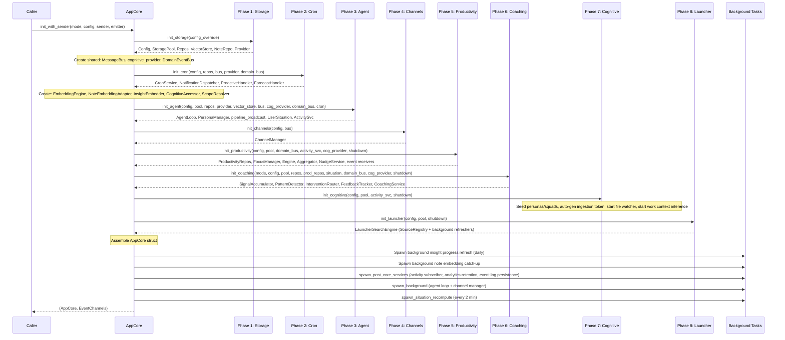

# Layer 7: app-core

> `crates/app-core/` -- Transport-agnostic application core containing all shared business logic, initialization orchestration, and handler implementations.

## Overview

`app-core` is the central orchestration crate that sits between feature crates (L1-L6) and the desktop adapter (L7). It owns the `AppCore` struct, the 8-phase initialization sequence, all business-logic handlers, adapter implementations for cross-crate trait bridging, and infrastructure services (file watcher, shell hook).

**Key design principle:** `AppCore` has zero Tauri or Axum references. Both the desktop app and the dev server wrap it with their own event wiring.

## Dependencies

```
desktop-shared, agent, bus, channels, cognitive, common, config,
feature-coaching, feature-finance, feature-insights, feature-launcher,
feature-learning, feature-notes, feature-productivity, feature-tasks,
providers, scheduling, session, storage, tools, tools-core,
activity-log, skill-system
```

## Module Structure

```
src/
  lib.rs                  -- Re-exports: AppCore, EntityUpdate, HandlerResult, AppEventEmitter, EventChannels
  state.rs                -- AppCore struct + accessor methods + shutdown
  events.rs               -- AppEventEmitter trait + NoopEmitter
  errors.rs               -- Error mapping helpers (map_prod_err, map_storage_err, parse_date, etc.)
  init/
    mod.rs                -- AppCore::init() orchestrator (8 phases) + spawn_background()
    storage.rs            -- Phase 1: config + SQLite + LanceDB + LLM provider + migrations
    cron.rs               -- Phase 2: CronService + 10 cron job registrations
    agent.rs              -- Phase 3: PersonaManager + ActivityLog + AgentLoop builder
    channels.rs           -- Phase 4: ChannelManager (Telegram/Discord/Slack/Email)
    productivity.rs       -- Phase 5: ProductivityEngine + FocusManager + NudgeService + DistractionMonitor
    coaching.rs            -- Phase 6: CoachingService pipeline (signals -> patterns -> interventions)
    cognitive.rs           -- Phase 7: Persona seeding + file watcher + work context inference
    launcher.rs            -- Phase 8: Launcher search sources + background refreshers
  handlers/
    mod.rs                -- 33 handler modules
    tasks/                -- CRUD, focus, proactive suggestions, decomposition, forecast, converters, queries
    notes/                -- CRUD, notebooks, inbox, suggestions, backlinks, insight review, flashcards, persona chat, language
    chat/                 -- Sessions, threads, streaming relay
    cognitive/             -- Memory CRUD, coaching debug, reflection, system status, event log, mutations
    finance/              -- Accounts, transactions, budgets, investments, reports
    productivity/         -- Tracking, focus, summaries, calendar, converters
    settings/             -- Config get/update, MCP server management
    launcher/             -- Search engine, execute, dashboard, clipboard, scripts
    agents.rs             -- Agent profile listing, file read/write
    annotations.rs        -- Note annotation CRUD + AI suggestion
    areas.rs              -- Area CRUD + reorder
    capture.rs            -- Ingestion status, shell hook install/uninstall
    coaching.rs           -- Coaching pipeline query handlers
    columns.rs            -- Custom column CRUD + values
    cron.rs               -- Cron job list/create/update/delete/run
    distraction.rs        -- Dismiss, allow temp/session, learned rules
    entities.rs           -- Entity search, merge, neighborhood graph
    entity_links.rs       -- Cross-entity link CRUD
    groups.rs             -- Task group CRUD + reorder
    integrations.rs       -- AI tool detection + skill installation
    key_results.rs        -- Key result CRUD + metric update
    objectives.rs         -- Objective CRUD
    project_conversations.rs
    project_memories.rs
    project_sources.rs
    projects.rs           -- Project CRUD + archive + instructions + role
    squads.rs             -- Persona squad CRUD + membership
    status.rs             -- Agent status
    timeline.rs           -- Unified timeline query
    work_context.rs       -- Work context CRUD + inference stats + dashboard intelligence
    workflows.rs          -- Status workflow + label CRUD
    workspace.rs          -- Workspace file listing/read/write
  adapters/
    mod.rs
    cognitive_accessor.rs -- CognitiveAccessor trait impl (bridges cognitive repos to feature-insights)
    flashcard_accessor.rs -- FlashcardAccessor trait impl (bridges cognitive flashcard repo to feature-insights)
    insight_embedder.rs   -- InsightEmbedder trait impl (bridges EmbeddingEngine + VectorStore to feature-insights)
    scope_resolver.rs     -- ScopeResolver trait impl (bridges NoteRepo + VectorStore to feature-insights)
  infrastructure/
    mod.rs
    file_watcher.rs       -- FileWatcherService (notify-rs debounced watcher -> ActivityIngestionService)
    shell_hook.rs         -- Shell hook install/uninstall for terminal capture
```

## AppCore Struct

`AppCore` is the central application state. It is transport-agnostic (no Tauri, no Axum) and holds all runtime services:

### Core Services
| Field | Type | Description |
|-------|------|-------------|
| `mode` | `AppMode` | `Desktop` or `Server` |
| `repos` | `Repos` | All SQLite repositories |
| `storage_pool` | `StoragePool` | Clone+Send+Sync SQLite pool |
| `agent` | `Arc<AgentLoop>` | The AI agent runtime |
| `bus` | `Arc<MessageBus>` | Inbound/outbound message bus |
| `persona_manager` | `Arc<RwLock<PersonaManager>>` | Agent personas |
| `config` | `RwLock<Config>` | Runtime configuration |
| `channel_manager` | `Arc<Mutex<ChannelManager>>` | Platform integrations |
| `cron_service` | `Arc<CronService>` | Scheduled jobs |
| `shutdown_token` | `CancellationToken` | Graceful shutdown signal |

### Chat/Streaming State
| Field | Type | Description |
|-------|------|-------------|
| `active_streams` | `Arc<DashMap<String, CancellationToken>>` | Active streaming sessions keyed by session_key |
| `pending_interactions` | `Arc<DashMap<String, (String, oneshot::Sender<FormResponse>)>>` | Pending ask_user interactions |
| `event_emitter` | `Arc<dyn AppEventEmitter>` | Transport-agnostic event emitter (Tauri or NoopEmitter) |

### Feature Services (Optional -- gated by config)
| Field | Type | Description |
|-------|------|-------------|
| `note_repo` | `NoteRepo` | Always available |
| `productivity_repos` | `Option<ProductivityRepos>` | Requires `productivity.enabled` |
| `focus_manager` | `Option<Arc<FocusManager>>` | Focus session management |
| `productivity_engine` | `Option<Arc<Mutex<ProductivityEngine>>>` | Activity tracker + categorizer |
| `aggregator` | `Option<Arc<DailyAggregator>>` | Daily productivity aggregation |
| `nudge_service` | `Option<Arc<Mutex<NudgeService>>>` | Break reminders + burnout alerts |
| `distraction_interceptor` | `Option<Arc<Mutex<DistractionInterceptor>>>` | Distraction detection during focus |
| `domain_event_bus` | `Option<Arc<DomainEventBus>>` | Cross-domain event bus |
| `cognitive_provider` | `Option<DynProvider>` | LLM provider for cognitive features |
| `pipeline_broadcast` | `Option<broadcast::Sender<PipelineEvent>>` | Memory pipeline events |
| `event_log_repo` | `Option<EventLogRepo>` | Persistent event log |
| `activity_ingestion_service` | `Option<Arc<ActivityIngestionService>>` | Unified activity log |

### Coaching Services (Desktop mode only)
| Field | Type | Description |
|-------|------|-------------|
| `signal_accumulator` | `Option<Arc<Mutex<SignalAccumulator>>>` | Coaching signal collection |
| `pattern_detector` | `Option<Arc<Mutex<PatternDetector>>>` | Behavioral pattern detection |
| `intervention_router` | `Option<Arc<Mutex<InterventionRouter>>>` | Coaching delivery routing |
| `feedback_tracker` | `Option<Arc<Mutex<FeedbackTracker>>>` | User feedback on coaching |
| `user_situation` | `Option<Arc<Mutex<UserSituation>>>` | Real-time user state |
| `coaching_service` | `Option<Arc<Mutex<CoachingService>>>` | Full coaching pipeline |

### AI Handlers (trait objects for dependency inversion)
| Field | Type | Description |
|-------|------|-------------|
| `proactive_handler` | `Option<Arc<dyn ProactiveHandler>>` | AI task suggestions |
| `suggestion_applier` | `Option<Arc<dyn SuggestionApplier>>` | Applies accepted suggestions |
| `decomposition_handler` | `Option<Arc<dyn DecompositionHandler>>` | AI task decomposition |
| `forecast_handler` | `Option<Arc<dyn ForecastHandler>>` | AI time estimation |
| `note_embedding_handler` | `Option<Arc<dyn NoteEmbeddingHandler>>` | Semantic note embedding |
| `insight_service` | `Option<Arc<InsightService>>` | Versioned insight reviews |
| `launcher_engine` | `Option<Arc<LauncherSearchEngine>>` | Launcher search engine |

### Accessor Methods

AppCore provides fallible accessor methods for optional services that return `ApiError` with code `FEATURE_DISABLED` or `NOT_AVAILABLE`:

- `productivity_repos()`, `focus_manager()`, `aggregator()`, `distraction_interceptor()`
- `signal_accumulator()`, `pattern_detector()`, `intervention_router()`, `feedback_tracker()`, `user_situation()`
- `domain_event_bus()`, `persona_repo()`, `flashcard_repo()`, `launcher_engine()`, `launcher_clipboard_repo()`
- `proactive_handler()`, `suggestion_applier()`, `decomposition_handler()`, `forecast_handler()`

### Shutdown

`AppCore::shutdown()` performs graceful shutdown in order:
1. Stop productivity engine (flush pending events)
2. Stop nudge service
3. Persist coaching feedback
4. Stop coaching service
5. Shutdown agent loop
6. Cancel shutdown token
7. Stop cron service

## Initialization Flow

`AppCore::init()` delegates to `init_with_sender()` which orchestrates 8 sequential phases plus post-init background tasks.

### Initialization Sequence



### Phase Details

#### Phase 1: Storage (`init/storage.rs`)
- Loads config (from override or disk with env overrides)
- Connects SQLite storage pool + LanceDB vector store
- Creates ANN indexes in background (needs 256+ rows)
- Runs feature migrations: notes, tasks, finance
- Creates LLM provider with failover + circuit breaker persistence
- Falls back to `NoopProvider` if no API key configured

#### Phase 2: Cron (`init/cron.rs`)
- Creates `CronService` and registers 10+ cron handlers:
  - `todo_focus_check` (every 30min) -- deadline notifications
  - `todo_daily_digest` (9am daily) -- task summary
  - `todo_overdue_check` (hourly) -- auto-unfocus expired tasks
  - `__klyntbot_cognitive_weekly_reflection` (Monday 9am) -- cognitive reflection
  - `__klyntbot_weekly_report` (Sunday 6pm) -- weekly progress report
  - `__klyntbot_daily_planning` (configurable) -- daily planning
  - `__klyntbot_finance_*` (4 jobs) -- daily review, budget check, price refresh, health check
  - `proactive_scan` (every 4h) -- AI task suggestions
- Bus-routed jobs publish to the agent via `InboundMessage`
- Builds AI handlers: `LlmDecompositionHandler`, `LlmForecastHandler`, `LlmProactiveHandler`, `TaskSuggestionApplier`

#### Phase 3: Agent (`init/agent.rs`)
- Loads `PersonaManager` from disk, resolves scopes
- Runs activity-log migrations
- Creates `ActivityIngestionService` with privacy filter
- Pre-creates `UserSituation` (defaults, recomputed later)
- Builds `AgentLoop` via builder pattern with: pool, cron service, notification handle, domain bus, cognitive provider, pipeline broadcast, user situation, activity service, vector store

#### Phase 4: Channels (`init/channels.rs`)
- Creates `ChannelManager` connecting Telegram, Discord, Slack, Email to the message bus

#### Phase 5: Productivity (`init/productivity.rs`)
- Gated by `config.productivity.enabled`
- Runs productivity migrations, creates repos
- Creates `FocusManager`, `DistractionInterceptor`, `DailyAggregator`
- Builds and starts `ProductivityEngine` (tracker + categorizer + subscribers)
- Starts `DistractionMonitor` and `ProductivityIntelligenceLayer`
- Creates `NudgeService` for break reminders

#### Phase 6: Coaching (`init/coaching.rs`)
- Desktop mode only (skipped in Server mode)
- Creates coaching pipeline: `SignalAccumulator` -> `PatternDetector` -> `InterventionRouter` -> `FeedbackTracker`
- Computes initial `UserSituation` from real data
- Starts `CoachingService` (subscribes to domain events, processes through pipeline)

#### Phase 7: Cognitive (`init/cognitive.rs`)
- Seeds builtin personas and squads (idempotent)
- Auto-generates ingestion API token on first startup
- Starts file watcher if configured
- Starts work context inference engine + loop

#### Phase 8: Launcher (`init/launcher.rs`)
- Always enabled
- Registers search sources (gated by config): Apps, Scripts, SystemCommands, Clipboard, SystemPrefs, Brew, SSH hosts, Git repos, Files (mdfind), Content grep (rg), Contacts, Running apps, Bookmarks, Browser history
- Creates `SourceRegistry` + `BackgroundRefresher` (periodic source refresh)
- Creates `SourceFileWatcher` (watches bookmark/ssh/script files for changes)

### Post-Init Background Tasks
- **Insight progress refresh**: Daily recomputation of insight progress snapshots
- **Note embedding catch-up**: Embeds up to 50 notes without embeddings on startup
- **Activity log subscriber**: Normalizes domain events into the unified activity log
- **Analytics retention**: Daily cleanup of old analytics records + low-salience fact pruning
- **Event log persistence**: Persists domain events and pipeline events to DB
- **Agent loop + channel manager**: Core message processing loops
- **Situation recompute**: Every 2 minutes, recomputes `UserSituation` from real productivity/task data

## EventChannels

`AppCore::init()` returns `EventChannels` alongside the `AppCore` instance. The caller (desktop or dev server) wires these to their transport:

| Channel | Type | Purpose |
|---------|------|---------|
| `intervention_rx` | `mpsc::Receiver<DeliveredIntervention>` | Coaching interventions for UI |
| `domain_event_bus` | `Arc<DomainEventBus>` | Subscribe for debug dashboard |
| `pipeline_rx` | `broadcast::Receiver<PipelineEvent>` | Cognitive pipeline events |
| `auto_focus_rx` | `Option<mpsc::Receiver<AutoFocusEvent>>` | Auto-detected focus sessions |
| `nudge_rx` | `Option<mpsc::Receiver<NudgeRecord>>` | Break/burnout nudges |
| `dashboard_tick_rx` | `Option<broadcast::Receiver<ActivityTick>>` | Live activity updates |
| `distraction_alert_rx` | `Option<mpsc::Receiver<DistractionAlert>>` | Distraction overlay triggers |

## emit_updates Pattern

Mutating handlers return `HandlerResult<T>` which is `Result<(T, Vec<EntityUpdate>), ApiError>`. The caller unpacks the entity updates and emits events to the frontend:

```rust
pub type HandlerResult<T> = Result<(T, Vec<EntityUpdate>), ApiError>;

pub struct EntityUpdate {
    pub kind: EntityKind,
    pub id: String,
}
```

The desktop adapter calls `commands::emit_updates(&app, &updates)` which emits `entity:updated` Tauri events. The frontend invalidates its caches based on `EntityKind`.

The `AppEventEmitter` trait provides a transport-agnostic version of this for MCP tool mutations:

```rust
pub trait AppEventEmitter: Send + Sync + 'static {
    fn emit_event(&self, event_name: &str, payload: serde_json::Value);
    fn emit_entity_updated(&self, kind: EntityKind, id: &str);  // default impl
}
```

Implementations:
- `TauriEventEmitter` (desktop) -- emits via `app_handle.emit()`
- `SseEmitter` (dev server) -- emits via `broadcast::Sender`
- `NoopEmitter` (tests/CLI) -- does nothing

## Adapters

The `adapters/` module implements dependency-inversion traits defined in lower-layer crates, bridging them to concrete implementations that require higher-layer dependencies:

| Adapter | Implements | Purpose |
|---------|-----------|---------|
| `CognitiveAccessorImpl` | `feature_insights::CognitiveAccessor` | Provides cognitive repo access to insight service |
| `FlashcardAccessorImpl` | `feature_insights::FlashcardAccessor` | Provides flashcard repo access to insight service |
| `InsightEmbedderImpl` | `feature_insights::InsightEmbedder` | Provides embedding + vector store to insight service |
| `ScopeResolverImpl` | `feature_insights::ScopeResolver` | Provides note repo + vector store for scope resolution |

## Handler Organization

All 33 handler modules implement business logic as `impl AppCore` methods. Handlers are grouped by domain:

### Tasks (handlers/tasks/)
- `crud.rs` -- create, update, delete, toggle_complete, list, get, list_children
- `focus.rs` -- start_focus, end_focus (with time tracking)
- `proactive.rs` -- run_proactive_scan, get_suggestions, apply_suggestion, dismiss_suggestion
- `decomposition.rs` -- decompose, apply_decomposition, reject_decomposition
- `forecast.rs` -- forecast (AI time estimation)
- `queries.rs` -- today_tasks, project_list, objective_list
- `suggestions.rs` -- suggestion management
- `converters.rs` -- storage row to response type conversion

### Notes (handlers/notes/)
- `crud.rs` -- CRUD, search, semantic search, hybrid search, backlinks
- `notebooks.rs` -- notebook CRUD
- `inbox.rs` -- quick capture inbox
- `suggestions.rs` -- related notes, link suggestions, tags
- `insight.rs` -- insight review orchestration (versioned, cached)
- `insight_context.rs` -- cognitive context injection into insights
- `insight_personas.rs` -- persona management for insight review
- `insight_prompts.rs` -- LLM prompt building for insights
- `flashcard.rs` -- FSRS spaced repetition flashcard management
- `card_generation.rs` -- AI flashcard generation from notes
- `persona_chat.rs` -- chat with persona in context of a note
- `language.rs` -- translation breakdown, evaluation
- `language_prompts.rs` -- LLM prompts for language features
- `converters.rs` -- note row to response conversion

### Chat (handlers/chat/)
- `sessions.rs` -- chat_send (enqueue message, create session context)
- `threads.rs` -- list threads, messages, pin, rename, delete
- `streaming.rs` -- spawn_chat_relay (agent stream -> event emitter)

### Cognitive (handlers/cognitive/)
- `memory.rs` -- user model, facts list, episodic list, rules list, stats
- `operations.rs` -- compaction, reflection, fact create/update/delete, rule create/deactivate
- `mutations.rs` -- event injection, coaching feedback, reset/clear operations
- `mod.rs` -- system status, coaching situation/signals/patterns, event log queries

### Finance (handlers/finance/)
- `accounts.rs`, `transactions.rs`, `budgets.rs`, `investments.rs`, `reports.rs`

### Productivity (handlers/productivity/)
- `tracking.rs` -- today summary, timeline, sessions, tracked apps, categories
- `focus.rs` -- focus start/end, pomodoro, auto-focus, break management
- `summaries.rs` -- weekly assessment, patterns, hourly breakdown, insights
- `calendar.rs` -- calendar event sync + query
- `converters.rs` -- productivity row to response conversion

## Error Handling

`errors.rs` provides mapper functions that convert domain errors into `ApiError`:

| Function | Converts | Error Code |
|----------|----------|-----------|
| `map_storage_err` | `StorageError` | `NOT_FOUND`, `CONFLICT`, `STORAGE_ERROR` |
| `map_prod_err` | `KlyntbotError` | `PRODUCTIVITY_ERROR` |
| `map_cognitive_err` | `Display` | `STORAGE_ERROR` |
| `map_config_save_err` | `Display` | `CONFIG_SAVE` |
| `map_serialization_err` | `Display` | `SERIALIZATION` |
| `map_activity_log_err` | `KlyntbotError` | `WORK_CONTEXT_ERROR` |

Also provides date parsing utilities: `parse_date`, `parse_date_or_err`, `parse_local_day_range`, `parse_naive_date`.
