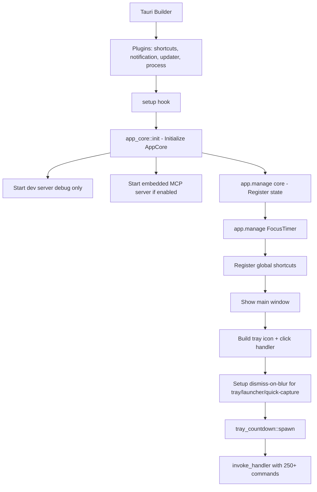
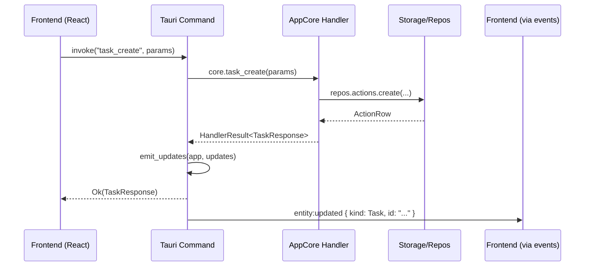

# Layer 7: desktop

> `crates/desktop/` -- Tauri 2 desktop application. Thin adapter that wires `AppCore` to Tauri IPC, manages windows, tray, focus timer, shortcuts, OAuth, and provides a debug-only HTTP dev server.

## Overview

The `desktop` crate is the Tauri 2 application entry point. It follows the "thin adapter" pattern: all business logic lives in `app-core`, and `desktop` is responsible only for:

1. Initializing `AppCore` and wiring `EventChannels` to Tauri events
2. Exposing `AppCore` methods as `#[tauri::command]` functions
3. Managing windows, tray icon, shortcuts, focus timer, tray countdown
4. Running the dev HTTP server (debug builds only)
5. Running the embedded MCP server (when configured)

## Dependencies

```
app-core, desktop-shared, agent, bus, channels, cognitive, common, config,
feature-coaching, feature-launcher, feature-notes, feature-productivity,
klyntbot-server, context_engine, providers, scheduling, session, storage,
tools, tools-core

Tauri plugins: global-shortcut, notification, updater, process
HTTP: axum, tower-http (for dev server)
MCP: rmcp (for embedded MCP server)
```

## Module Structure

```
src/
  main.rs               -- Entry point: CLI parser, run_mcp_stdio(), run_desktop_app()
  app_core.rs            -- Desktop adapter: init() + wire_event_channels() + TauriEventEmitter
  focus_timer.rs         -- FocusTimer state machine with 1-second tray updates
  tray_countdown.rs      -- Background tray countdown (next event/task deadline)
  notify.rs              -- TauriNotificationSender (routes notifications through Tauri plugin)
  shortcuts.rs           -- Global shortcut registration (launcher, tray, quick-capture)
  oauth/
    mod.rs               -- OAuth submodule declarations
    flow.rs              -- OAuth flow management
    registry.rs          -- OAuth provider registry
    commands.rs          -- mcp_oauth_start, mcp_oauth_disconnect
  commands/
    mod.rs               -- 36 command modules + emit_updates() + emit_entity_updated()
    tasks.rs             -- 17 task commands + dispatch_dev
    notes.rs             -- 62 note commands + dispatch_dev
    chat.rs              -- 8 chat commands + dispatch_dev
    finance.rs           -- 27 finance commands + dispatch_dev
    productivity.rs      -- 33 productivity commands + dispatch_dev
    cognitive.rs         -- 27 cognitive commands + dispatch_dev
    settings.rs          -- 7 settings commands + dispatch_dev
    areas.rs             -- 5 area commands + dispatch_dev
    projects.rs          -- 7 project commands + dispatch_dev
    objectives.rs        -- 4 objective commands + dispatch_dev
    key_results.rs       -- 4 key result commands + dispatch_dev
    workflows.rs         -- 8 workflow commands + dispatch_dev
    groups.rs            -- 5 group commands + dispatch_dev
    columns.rs           -- 8 column commands + dispatch_dev
    autotuner.rs         -- 5 autotuner commands (status, history, revert, pause, resume) + dispatch_dev
    entities.rs          -- 3 entity commands + dispatch_dev
    entity_links.rs      -- 3 entity link commands + dispatch_dev
    squads.rs            -- 7 squad commands + dispatch_dev
    cron.rs              -- 7 cron commands + dispatch_dev
    status.rs            -- 1 status command + dispatch_dev
    distraction.rs       -- 5 distraction commands + dispatch_dev
    timeline.rs          -- 1 timeline command + dispatch_dev
    work_context.rs      -- 11 work context commands + dispatch_dev
    capture.rs           -- 6 capture commands + dispatch_dev
    workspace.rs         -- 3 workspace commands + dispatch_dev
    agents.rs            -- 6 agent commands + dispatch_dev
    integrations.rs      -- 2 integration commands + dispatch_dev
    launcher.rs          -- 9 launcher commands + dispatch_dev
    annotations.rs       -- 5 annotation commands + dispatch_dev
    language.rs          -- 5 language commands + dispatch_dev
    project_sources.rs   -- 3 project source commands + dispatch_dev
    project_memories.rs  -- 2 project memory commands + dispatch_dev
    project_conversations.rs -- 1 project conversation command + dispatch_dev
    permissions.rs       -- 2 permission commands (Tauri-only)
    shortcuts.rs         -- 2 shortcut commands + dispatch_dev
    window.rs            -- 4 window commands (Tauri-only): resize_window, open_url, show_dashboard, quit_app
    dev_helpers.rs       -- JSON body parsing helpers for dev server (debug only)
  dev_server/
    mod.rs               -- Axum server on port 3456 + parity tests
    dispatch.rs          -- Central dispatch: routes POST /api/{cmd} to command modules
    streaming.rs         -- SSE endpoints for chat, cognitive, and insight streaming
    ingest.rs            -- Activity ingestion API endpoints
```

## Application Entry Point

`main.rs` parses CLI arguments via `clap`:

- **No subcommand**: Runs the full desktop app (`run_desktop_app()`)
- **`mcp serve --stdio`**: Runs a standalone MCP server over stdin/stdout (`run_mcp_stdio()`)

### run_desktop_app()



### run_mcp_stdio()

Initializes `AppCore` in `Server` mode, builds `KlyntbotServerHandler`, and serves MCP over stdio transport. Drains unused `EventChannels` receivers in a background task.

## Command Flow



## All Tauri Command Functions

### Timeline / Dashboard
| Command | Module | Description |
|---------|--------|-------------|
| `timeline_query` | `timeline` | Query unified timeline by date range + sources |

### Tasks (17 commands)
| Command | Module | Description |
|---------|--------|-------------|
| `today_tasks` | `tasks` | Tasks due today (for tray view) |
| `task_get` | `tasks` | Get single task by ID |
| `task_list` | `tasks` | List tasks with filters |
| `task_create` | `tasks` | Create a new task |
| `task_update` | `tasks` | Update task fields |
| `task_delete` | `tasks` | Delete a task |
| `task_toggle_complete` | `tasks` | Toggle completion status |
| `task_list_children` | `tasks` | List subtasks |
| `task_start_focus` | `tasks` | Start focus on a task (time tracking) |
| `task_end_focus` | `tasks` | End task focus |
| `task_get_suggestions` | `tasks` | Get AI proactive suggestions |
| `task_apply_suggestion` | `tasks` | Apply an AI suggestion |
| `task_dismiss_suggestion` | `tasks` | Dismiss a suggestion |
| `task_decompose` | `tasks` | AI task decomposition |
| `task_apply_decomposition` | `tasks` | Apply decomposition subtasks |
| `task_reject_decomposition` | `tasks` | Reject decomposition |
| `task_forecast` | `tasks` | AI time estimation |
| `project_list` | `tasks` | List all projects |
| `objective_list` | `tasks` | List objectives for project |

### Notes (62 commands)
| Command | Module | Description |
|---------|--------|-------------|
| `note_list` | `notes` | List notes (optional notebook filter) |
| `note_get` | `notes` | Get single note |
| `note_create` | `notes` | Create note |
| `note_update` | `notes` | Update note fields |
| `note_delete` | `notes` | Delete note |
| `note_search` | `notes` | Full-text search |
| `note_search_semantic` | `notes` | Vector similarity search |
| `note_search_hybrid` | `notes` | Combined text + semantic search |
| `note_links_all` | `notes` | All note-to-note links |
| `note_list_by_entity` | `notes` | Notes linked to a specific entity |
| `note_version_list` | `notes` | Version history for a note |
| `note_version_create` | `notes` | Create a version snapshot |
| `note_version_restore` | `notes` | Restore from version |
| `note_save_attachment` | `notes` | Save file attachment |
| `notebook_list` | `notes` | List notebooks |
| `notebook_create` | `notes` | Create notebook |
| `notebook_update` | `notes` | Update notebook |
| `notebook_delete` | `notes` | Delete notebook |
| `note_archive` / `note_unarchive` | `notes` | Archive management |
| `note_list_archived` | `notes` | List archived notes |
| `note_backlinks` | `notes` | Find notes that link to a given note |
| `note_suggestions` | `notes` | Related notes + link suggestions |
| `note_tags_all` | `notes` | All unique tags |
| `note_unlinked_mentions` | `notes` | Detect unlinked mentions |
| `inbox_create` / `inbox_list` / `inbox_delete` | `notes` | Quick capture inbox |
| `note_insight_review` | `notes` | Generate/cache insight review |
| `note_insight_cache_get` | `notes` | Get cached insight |
| `note_insight_save_flashcards` | `notes` | Save quiz questions as flashcards |
| `note_insight_submit_quiz` | `notes` | Record quiz score |
| `note_insight_regenerate_tab` | `notes` | Regenerate a single insight tab |
| `note_insight_debate` | `notes` | Persona debate on note content |
| `note_insight_list_versions` | `notes` | Insight version history |
| `note_insight_get_evolution` | `notes` | Track knowledge growth over time |
| `note_insight_get_version` | `notes` | Get specific insight version |
| `note_insight_generate_scenario` | `notes` | Generate scenario challenge |
| `note_insight_changes_summary` | `notes` | Summarize changes between versions |
| `note_insight_knowledge_growth` | `notes` | Knowledge growth metrics |
| `note_insight_list_personas` | `notes` | List insight personas |
| `note_insight_create_persona` | `notes` | Create custom persona |
| `note_insight_update_persona` | `notes` | Update persona |
| `note_insight_delete_persona` | `notes` | Delete persona |
| `note_insight_toggle_persona` | `notes` | Toggle persona active state |
| `note_insight_set_pins` | `notes` | Pin personas to a note |
| `note_insight_rate_persona` | `notes` | Rate persona helpfulness |
| `note_insight_auto_generate_persona` | `notes` | AI-generate persona for a note |
| `note_insight_persona_chat` | `notes` | Chat with persona about a note |
| `flashcard_list_decks` | `notes` | List flashcard decks |
| `flashcard_get_due` | `notes` | Get due cards for a deck |
| `flashcard_get_all_due` | `notes` | Get all due cards across decks |
| `flashcard_total_due` | `notes` | Count total due cards |
| `flashcard_record_review` | `notes` | Record FSRS review |
| `flashcard_get` / `flashcard_create` / `flashcard_update` / `flashcard_delete` | `notes` | Flashcard CRUD |
| `flashcard_list_cards` | `notes` | List cards in a deck |
| `flashcard_generate` | `notes` | AI generate flashcards from note/text |
| `flashcard_save_generated` | `notes` | Save generated flashcards |

### Annotations (5 commands)
| Command | Module | Description |
|---------|--------|-------------|
| `annotation_create` | `annotations` | Create note annotation |
| `annotation_update` | `annotations` | Update annotation |
| `annotation_delete` | `annotations` | Delete annotation |
| `annotation_list_for_note` | `annotations` | List annotations for a note |
| `annotation_get_ai_suggestion` | `annotations` | Get AI suggestion for highlighted text |
| `note_get_linked_context` | `annotations` | Get cognitive context linked to note section |

### Language Learning (5 commands)
| Command | Module | Description |
|---------|--------|-------------|
| `language_translate_breakdown` | `language` | Word-by-word translation breakdown |
| `language_evaluate_translation` | `language` | Grade a user's translation attempt |
| `language_save_vocabulary` | `language` | Save words as flashcards |
| `language_detect_confusables` | `language` | Find confusable words |
| `language_enrich_annotation` | `language` | Enrich annotation with translation |

### Areas (5 commands)
| Command | Module | Description |
|---------|--------|-------------|
| `area_list` / `area_create` / `area_update` / `area_delete` | `areas` | Area CRUD |
| `area_reorder` | `areas` | Reorder areas |

### Projects (7 commands)
| Command | Module | Description |
|---------|--------|-------------|
| `project_create` / `project_get` / `project_update` / `project_delete` | `projects` | Project CRUD |
| `project_archive` | `projects` | Archive a project |
| `project_update_instructions` | `projects` | Update project AI instructions |
| `project_update_role` | `projects` | Update user role in project |

### Entities (3 commands)
| Command | Module | Description |
|---------|--------|-------------|
| `entity_search` | `entities` | Search knowledge graph entities |
| `entity_merge` | `entities` | Merge two entities |
| `entity_get_neighborhood` | `entities` | Get entity + relationships |

### Entity Links (3 commands)
| Command | Module | Description |
|---------|--------|-------------|
| `entity_link_create` | `entity_links` | Create cross-entity link |
| `entity_link_delete` | `entity_links` | Delete entity link |
| `entity_links_for_entity` | `entity_links` | Get all links for an entity |

### Project Sources / Memories / Conversations (6 commands)
| Command | Module | Description |
|---------|--------|-------------|
| `project_source_create` / `project_source_delete` / `project_source_list` | `project_sources` | Project source CRUD |
| `project_memories_list` / `project_memories_by_type` | `project_memories` | List project memories |
| `project_conversations_list` | `project_conversations` | List project conversations |

### OKR (8 commands)
| Command | Module | Description |
|---------|--------|-------------|
| `objective_create` / `objective_get` / `objective_update` / `objective_delete` | `objectives` | Objective CRUD |
| `key_result_create` / `key_result_update` / `key_result_delete` | `key_results` | Key result CRUD |
| `key_result_update_metric` | `key_results` | Update KR current value |

### Chat (8 commands)
| Command | Module | Description |
|---------|--------|-------------|
| `chat_threads` | `chat` | List chat threads |
| `chat_messages` | `chat` | Get messages for a thread |
| `chat_send` | `chat` | Send message + start streaming |
| `chat_pin_thread` | `chat` | Pin/unpin a thread |
| `chat_rename_thread` | `chat` | Rename thread title |
| `chat_delete_thread` | `chat` | Delete thread + messages |
| `chat_respond_interaction` | `chat` | Respond to ask_user form |
| `chat_cancel` | `chat` | Cancel active streaming |

### Finance (27 commands)
| Command | Module | Description |
|---------|--------|-------------|
| `finance_accounts` | `finance` | List accounts |
| `finance_transactions` / `finance_transactions_filtered` | `finance` | List transactions |
| `finance_budget_usage` | `finance` | Budget vs actual |
| `finance_portfolios` | `finance` | List portfolios |
| `finance_investments` / `finance_investments_filtered` | `finance` | List investments |
| `finance_goals` | `finance` | List goals |
| `finance_liabilities` | `finance` | List liabilities |
| `finance_net_worth` | `finance` | Net worth calculation |
| `finance_exchange_rates` | `finance` | Current exchange rates |
| `finance_account_create` / `_update` / `_delete` | `finance` | Account mutations |
| `finance_transaction_create` / `_delete` | `finance` | Transaction mutations |
| `finance_budget_create` / `_update` / `_delete` | `finance` | Budget mutations |
| `finance_goal_create` / `_update` / `_delete` | `finance` | Goal mutations |
| `finance_liability_create` / `_update` / `_delete` | `finance` | Liability mutations |
| `finance_portfolio_create` | `finance` | Portfolio creation |
| `finance_investment_create` / `_update` | `finance` | Investment mutations |
| `finance_report_spending` / `_income` / `_trends` | `finance` | Report queries |
| `finance_monthly_summary` / `finance_daily_spending` / `finance_period_summary` | `finance` | Summary queries |

### Productivity (33 commands)
| Command | Module | Description |
|---------|--------|-------------|
| `productivity_today` | `productivity` | Today's summary |
| `productivity_timeline` | `productivity` | Activity timeline |
| `productivity_focus_start` / `_end` / `_status` | `productivity` | Focus session management |
| `productivity_sessions` | `productivity` | List focus sessions |
| `productivity_intelligence_sessions` | `productivity` | AI-classified sessions |
| `productivity_weekly` | `productivity` | Weekly summary |
| `productivity_categories` | `productivity` | Activity categories |
| `productivity_summary_range` | `productivity` | Summary for date range |
| `productivity_activity_feed` | `productivity` | Recent activity events |
| `productivity_goals` | `productivity` | Productivity goals |
| `productivity_pomodoro_start` | `productivity` | Start pomodoro |
| `productivity_time_entries` | `productivity` | Manual time entries |
| `productivity_goal_create` / `_delete` / `_toggle` | `productivity` | Goal mutations |
| `productivity_time_entry_create` / `_delete` | `productivity` | Time entry mutations |
| `productivity_category_upsert` / `_delete` | `productivity` | Category mutations |
| `productivity_tracked_apps` | `productivity` | Tracked app list |
| `productivity_recategorize_app` | `productivity` | Recategorize an app |
| `productivity_insights` / `_insight_dismiss` | `productivity` | Insight cards |
| `productivity_auto_focus_start` / `_end` | `productivity` | Auto-focus management |
| `distraction_respond` | `productivity` | Respond to distraction alert |
| `productivity_projects_list` / `_project_upsert` / `_project_delete` | `productivity` | Productivity project mapping |
| `productivity_weekly_assessment` | `productivity` | Weekly assessment |
| `productivity_calendar_events` / `calendar_sync_events` | `productivity` | Calendar integration |
| `productivity_patterns` / `_hourly_breakdown` | `productivity` | Pattern analysis |

### Focus Timer (7 commands, Tauri-only)
| Command | Module | Description |
|---------|--------|-------------|
| `focus_timer_start` | `productivity` | Start focus timer |
| `focus_timer_stop` | `productivity` | Stop timer early |
| `focus_timer_status` | `productivity` | Get timer status |
| `focus_break_start` | `productivity` | Start break countdown |
| `focus_timer_extend` | `productivity` | Add time to running timer |
| `focus_timer_pause` | `productivity` | Pause timer |
| `focus_timer_resume` | `productivity` | Resume paused timer |

### Distraction (5 commands)
| Command | Module | Description |
|---------|--------|-------------|
| `distraction_dismiss` | `distraction` | Dismiss distraction alert |
| `distraction_allow_temp` | `distraction` | Allow app temporarily |
| `distraction_allow_session` | `distraction` | Allow app for session |
| `distraction_learned_rules` | `distraction` | List learned rules |
| `distraction_delete_rule` | `distraction` | Delete a learned rule |

### Permissions (2 commands, Tauri-only)
| Command | Module | Description |
|---------|--------|-------------|
| `permissions_check_accessibility` | `permissions` | Check macOS accessibility |
| `permissions_open_accessibility` | `permissions` | Open accessibility settings |

### Settings (7 commands)
| Command | Module | Description |
|---------|--------|-------------|
| `mcp_get_config` | `settings` | Get MCP server configuration |
| `mcp_add_server` / `mcp_remove_server` / `mcp_toggle_server` / `mcp_update_server` | `settings` | MCP server management |
| `app_info` | `settings` | App version + data dir + setup status |
| `config_get_section` / `config_update_section` | `settings` | Generic config read/write |
| `config_mark_setup_completed` | `settings` | Mark first-time setup done |

### Shortcuts (2 commands)
| Command | Module | Description |
|---------|--------|-------------|
| `shortcuts_get` | `shortcuts` | Get current shortcut config |
| `shortcuts_update` | `shortcuts` | Update and re-register shortcuts |

### OAuth (2 commands, Tauri-only)
| Command | Module | Description |
|---------|--------|-------------|
| `mcp_oauth_start` | `oauth::commands` | Start OAuth flow for MCP server |
| `mcp_oauth_disconnect` | `oauth::commands` | Disconnect OAuth |

### Workflows (8 commands)
| Command | Module | Description |
|---------|--------|-------------|
| `workflow_list` / `workflow_get` / `workflow_get_effective` / `workflow_create` / `workflow_delete` | `workflows` | Status workflow CRUD |
| `label_create` / `label_update` / `label_delete` / `label_reorder` | `workflows` | Status label management |

### Groups (5 commands)
| Command | Module | Description |
|---------|--------|-------------|
| `group_list` / `group_create` / `group_update` / `group_delete` / `group_reorder` | `groups` | Task group management |

### Columns (8 commands)
| Command | Module | Description |
|---------|--------|-------------|
| `custom_column_list` / `_create` / `_update` / `_delete` / `_reorder` | `columns` | Custom column management |
| `custom_column_values` / `_value_set` / `_value_delete` | `columns` | Column value management |

### Cognitive / Coaching (27 commands)
| Command | Module | Description |
|---------|--------|-------------|
| `cognitive_user_model` | `cognitive` | User model summary |
| `cognitive_facts_list` / `_episodic_list` / `_rules_list` | `cognitive` | Memory listing |
| `cognitive_memory_stats` | `cognitive` | Memory statistics |
| `coaching_situation` | `cognitive` | Current user situation |
| `coaching_signals` / `_patterns` | `cognitive` | Coaching pipeline state |
| `coaching_feedback_stats` / `_router_status` | `cognitive` | Coaching effectiveness |
| `coaching_pending_interventions` | `cognitive` | Pending interventions |
| `cognitive_system_status` | `cognitive` | System component status |
| `cognitive_fact_create` / `_update` / `_delete` | `cognitive` | Fact mutations |
| `cognitive_rule_create` / `_deactivate` | `cognitive` | Rule mutations |
| `cognitive_run_compaction` / `_reflection` | `cognitive` | Manual maintenance |
| `coaching_reset_dismissals` / `_clear_signals` | `cognitive` | Reset coaching state |
| `coaching_submit_feedback` / `_report_ignored` | `cognitive` | Coaching feedback |
| `cognitive_inject_event` | `cognitive` | Inject test domain event |
| `cognitive_event_log` / `_pipeline_log` | `cognitive` | Event log queries |

### Squads (7 commands)
| Command | Module | Description |
|---------|--------|-------------|
| `list_squads` / `get_squad` / `create_squad` / `update_squad` / `delete_squad` | `squads` | Squad CRUD |
| `add_squad_member` / `remove_squad_member` | `squads` | Squad membership |

### Cron / Automations (7 commands)
| Command | Module | Description |
|---------|--------|-------------|
| `cron_list` / `cron_status` | `cron` | List jobs and service status |
| `cron_enable` | `cron` | Toggle job enabled state |
| `cron_run` | `cron` | Trigger job manually |
| `cron_delete` | `cron` | Delete a job |
| `cron_create` / `cron_update` | `cron` | Job CRUD |

### Status (1 command)
| Command | Module | Description |
|---------|--------|-------------|
| `agent_status` | `status` | Agent status + active task count |

### Work Contexts (11 commands)
| Command | Module | Description |
|---------|--------|-------------|
| `list_work_contexts` / `get_work_context` / `get_work_context_detail` | `work_context` | Work context queries |
| `update_work_context` / `archive_work_context` / `merge_work_contexts` | `work_context` | Work context mutations |
| `search_work_contexts` | `work_context` | Search contexts |
| `get_context_timeline` / `get_context_resume_data` | `work_context` | Context timeline + resume |
| `get_inference_stats` / `get_dashboard_intelligence` | `work_context` | Intelligence dashboard |
| `update_inference_config` | `work_context` | Update inference config |

### Capture (6 commands)
| Command | Module | Description |
|---------|--------|-------------|
| `capture_status` | `capture` | Capture subsystem status |
| `capture_shell_hook_status` / `_install` / `_uninstall` | `capture` | Shell hook management |
| `capture_get_ingestion_token` / `_regenerate` | `capture` | API ingestion token |

### Workspace (3 commands)
| Command | Module | Description |
|---------|--------|-------------|
| `workspace_list_files` / `_read_file` / `_write_file` | `workspace` | Workspace config files |

### Integrations (2 commands)
| Command | Module | Description |
|---------|--------|-------------|
| `ai_tools_detect` | `integrations` | Detect installed AI tools |
| `ai_tools_install` | `integrations` | Install MCP config to AI tools |

### Agents (6 commands)
| Command | Module | Description |
|---------|--------|-------------|
| `agent_list_profiles` | `agents` | List agent profiles |
| `agent_read_file` / `agent_write_file` / `agent_delete_file` | `agents` | Agent file CRUD |
| `agent_create_profile` / `agent_create_skill` | `agents` | Create new profile/skill |

### Launcher (9 commands)
| Command | Module | Description |
|---------|--------|-------------|
| `launcher_search` | `launcher` | Search across all sources |
| `launcher_execute` | `launcher` | Execute a search result |
| `launcher_dashboard` | `launcher` | Dashboard data |
| `launcher_clipboard_paste` / `_delete` / `_pin` | `launcher` | Clipboard management |
| `launcher_window_action` | `launcher` | Window management actions |
| `launcher_run_script` | `launcher` | Execute a launcher script |
| `launcher_system_command` | `launcher` | Run system command |
| `launcher_open_app` | `launcher` | Open application |

### Window (4 commands, Tauri-only)
| Command | Module | Description |
|---------|--------|-------------|
| `resize_window` | `window` | Resize launcher/tray window |
| `open_url` | `window` | Open URL in default browser |
| `show_dashboard` | `window` | Show + focus main window |
| `quit_app` | `window` | Exit application |

## DEV_COMMANDS Pattern

Every command module exports `pub const DEV_COMMANDS: &[&str]` listing all command names it handles in the dev server. This enables the parity test:

```rust
// In dev_server/mod.rs tests:
#[test]
fn dev_server_covers_all_tauri_commands() {
    // Parses main.rs to find all registered Tauri commands
    // Collects all DEV_COMMANDS from all modules
    // Asserts no Tauri command is missing from dev dispatch
    // (excluding TAURI_ONLY commands like permissions, focus_timer, oauth, window)
}

#[test]
fn dev_server_has_no_orphan_commands() {
    // Ensures no dev command exists without a Tauri registration
}
```

**TAURI_ONLY commands** (no dev server equivalent): `permissions_check_accessibility`, `permissions_open_accessibility`, `resize_window`, `open_url`, `quit_app`, `show_dashboard`, `focus_timer_*` (7 commands), `mcp_oauth_*` (2 commands).

## Dev Server Implementation

The dev server (`dev_server/`) runs only in debug builds on `http://127.0.0.1:3456`. It enables browser-based development by exposing Tauri commands as REST endpoints.

### Architecture

```
DevState
  +-- core: Arc<AppCore>
  +-- sse_channels: Arc<DashMap<String, broadcast::Sender<(String, Value)>>>
  +-- insight_tx: broadcast::Sender<(String, Value)>
```

### Endpoints

| Method | Path | Handler | Description |
|--------|------|---------|-------------|
| POST | `/api/{cmd}` | `dispatch::dispatch` | Routes to command module dispatch_dev functions |
| GET | `/api/events/{sessionKey}` | `streaming::sse_handler` | SSE stream for chat agent events |
| GET | `/api/cognitive/stream` | `streaming::cognitive_sse_handler` | SSE stream for domain + pipeline events |
| GET | `/api/insight/events` | `streaming::insight_sse_handler` | SSE stream for insight review events |
| POST | `/api/v1/ingest` | `ingest::ingest_handler` | Single activity log ingestion |
| POST | `/api/v1/ingest/batch` | `ingest::ingest_batch_handler` | Batch activity log ingestion |

### Dispatch Flow

`dispatch.rs` chains module-specific `dispatch_dev()` calls. Each module's `dispatch_dev()` matches on the command name and delegates to the same `AppCore` handler that the Tauri command uses. Special cases handled inline:
- `chat_send` -- needs SSE channel state for streaming
- `note_insight_review` -- needs SSE emitter for tab streaming
- `open_url` -- opens URL in browser

### SSE Streaming

The `SseEmitter` bridges `AppEventEmitter` to a `broadcast::Sender`:

```rust
struct SseEmitter {
    tx: broadcast::Sender<(String, Value)>,
}

impl AppEventEmitter for SseEmitter {
    fn emit_event(&self, event_name: &str, payload: Value) {
        let _ = self.tx.send((event_name.to_string(), payload));
    }
}
```

The frontend connects via `new EventSource("/api/events/{sessionKey}")` in browser dev mode.

### CORS

Allows requests from `http://localhost:1420` (Vite dev server) with GET, POST, OPTIONS methods.

### ApiResult

Maps AppCore results to HTTP responses:

| Error Code | HTTP Status |
|-----------|-------------|
| `NOT_FOUND` | 404 |
| `CONFLICT` | 409 |
| `VALIDATION`, `INVALID_PARAMS` | 400 |
| `FEATURE_DISABLED` | 503 |
| Other | 500 |

## Tray Countdown

`tray_countdown.rs` shows the next upcoming calendar event or task deadline in the macOS menu bar with a live countdown.

### Behavior
- Polls DB every 30 seconds for the next event/task due today
- Ticks every 1 second to update the countdown display
- Format: `"<< 24:57 . Standup"` (truncated to 20 chars)
- Only shows items due today (local timezone boundary)
- Clears when the item time passes, then re-queries

### Focus Timer Coordination

Uses the `FOCUS_ACTIVE` atomic flag to coordinate with the focus timer:

```rust
pub static FOCUS_ACTIVE: AtomicBool = AtomicBool::new(false);
```

- When focus timer starts: sets `FOCUS_ACTIVE = true`, owns the tray title
- Countdown loop checks flag each tick, yields when active
- When focus timer ends: calls `notify_focus_ended()` which clears the flag and resets tray title

## Focus Timer

`focus_timer.rs` implements a state machine for focus sessions, pomodoro timers, and break countdowns.

### State Machine

```
     start()          mark_completed()
Idle ---------> Running ----------------> Idle
                  |  ^
          pause() |  | resume()
                  v  |
                Paused
                  |
          stop()  |
                  v
                Idle
```

### Features
- Three modes: `Focus`, `Pomodoro`, `Break`
- 1-second tokio interval for countdown
- Updates tray icon title each tick: `"25:00"` or `"25:00 . Task Name"` or `"[pause] 25:00"`
- Emits `focus:tick` events to frontend
- 30-second warning: pops open tray window
- Pause/Resume via mpsc command channel
- Runtime extension via `Extend(secs)` command
- On completion:
  - Focus/Pomodoro: ends AppCore focus session (computes quality), sends notification, plays sound, emits `focus:completed`
  - Break: ends break session, sends notification, plays sound
- Sound: macOS `afplay` system sounds (Glass.aiff for focus, Blow.aiff for break)
- Configurable: sound and notification preferences per session

## Window Management

Three auxiliary windows alongside the main window:

| Window | Label | Behavior |
|--------|-------|----------|
| Tray popup | `tray` | Transparent, dismiss-on-blur, positioned below tray icon |
| Launcher | `launcher` | Transparent, dismiss-on-blur, centered |
| Quick capture | `quick-capture` | Dismiss-on-blur, centered |

### Window Labels
```rust
pub const WINDOW_TRAY: &str = "tray";
pub const WINDOW_LAUNCHER: &str = "launcher";
pub const WINDOW_QUICK_CAPTURE: &str = "quick-capture";
```

### Main Window Behavior
- Starts hidden (via `tauri.conf.json`), shown after init completes
- Close button hides instead of quitting (keeps tray alive)
- When hidden, app switches to `Accessory` activation policy (no Dock icon)
- `show_dashboard` restores `Regular` policy and shows/focuses window

## Global Shortcuts

Three configurable global shortcuts registered via `tauri-plugin-global-shortcut`:

| Config Key | Default | Action |
|-----------|---------|--------|
| `shortcuts.launcher` | `Cmd+Space` | Toggle launcher window |
| `shortcuts.tray` | `Cmd+Shift+Space` | Toggle tray popup |
| `shortcuts.quick_capture` | `Cmd+Shift+C` | Toggle quick capture |

Registration is two-phase:
1. Parse all shortcut strings (fail fast before touching OS state)
2. Register each with its toggle handler

Falls back to defaults if config shortcuts are invalid.

## Notification System

`TauriNotificationSender` wraps `tauri-plugin-notification` to route OS notifications through the Tauri plugin (shows Klynt app icon instead of Script Editor icon on macOS).

Implements `common::NotificationSender` trait for use by the agent's `NotificationDispatcher`.

## Event Channel Wiring

`app_core.rs` wires `EventChannels` receivers to Tauri events via `spawn_channel_forwarder`:

| Source Channel | Tauri Event(s) | Description |
|---------------|----------------|-------------|
| `auto_focus_rx` | `focus:auto_started`, `focus:auto_detected` | Auto-detected focus sessions |
| `dashboard_tick_rx` | `activity:switch`, `score:updated`, `focus:state_changed` | Live dashboard updates (via `DashboardEmitter`) |
| `nudge_rx` | `productivity:nudge` | Break/burnout nudges |
| `distraction_alert_rx` | `distraction:intervention`, `distraction:detected` | Distraction overlay + banner |
| `intervention_rx` | `coaching:intervention` | Coaching nudges + tray popup when unfocused |
| `domain_event_bus` (subscribe) | `cognitive:domain_event` | Debug dashboard |
| `pipeline_rx` | `cognitive:extraction`, `cognitive:consolidation` | Pipeline events |

## Tauri Configuration

Config file: `crates/desktop/tauri.conf.json`

Key configuration:
- `macos-private-api` enabled (for tray icon, activation policy)
- `tray-icon` + `image-png` features
- `beforeBuildCommand` uses `bun` (must be installed globally)
- Plugins: global-shortcut, notification, updater, process
