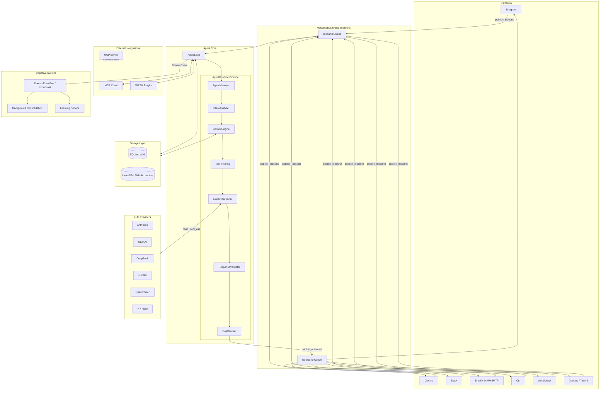

# Klyntbot Architecture Overview

## What is Klyntbot?

Klyntbot is a Rust-based personal AI agent platform that connects multiple chat platforms (Telegram, Discord, Slack, Email, CLI, WebSocket, and a Tauri desktop app) to LLM providers through a unified message bus. It provides task and project management (OKR + PARA frameworks), persistent memory via SQLite and LanceDB vector embeddings, a cognitive learning system, and extensibility through WASM plugins and the Model Context Protocol (MCP). The entire system ships as a single binary backed by a 27-crate workspace.

## High-Level Architecture



## Crate Layer Table

The workspace contains 27 member crates organized into 9 layers. Dependencies flow strictly upward (L0 has no internal dependencies; L8 depends on everything).

| Layer | Crate | Purpose |
|-------|-------|---------|
| **L0** | `common` | Foundation types: `KlyntbotError`, `Result<T>`, `MessageRole`, `ChannelName`, `ChatId`, `SessionKey`, `EntityCard`, interaction/prompt types |
| **L1** | `config` | Configuration schema (`Config`), camelCase JSON loader, `Secret<String>`, env var overrides |
| | `bus` | `MessageBus` (dual mpsc queues for inbound/outbound), `DomainEventBus` (broadcast), `LearningEventBus`, message types |
| | `tools-core` | `Tool` trait, `FeaturePackage` trait, `FeatureMigration`, `ToolParams`, `ActionParams`, `DynTool` |
| | `tools-core-macros` | Proc-macro derives: `#[derive(Tool)]`, `#[derive(ToolParams)]`, `#[derive(ActionParams)]`, `#[tool_actions]` |
| **L2** | `storage` | `StoragePool` (SQLite wrapper with WAL + migrations), 20+ `*Repo` structs, `VectorStore` (LanceDB), row types |
| | `domain` | OKR + PARA domain types: `Objective`, `KeyResult`, `Area`, `AreaStatus`, `Project` |
| **L3** | `providers` | `LlmProvider` trait, `OpenAiCompatProvider`, `AnthropicNativeProvider`, `ProviderRegistry` (12 providers), `ProviderManager` (failover + circuit breaker), streaming support |
| | `session` | `SessionManager`, `Session`, per-session `Arc<Mutex<Session>>` locking, SQLite persistence |
| | `scheduling` | `CronService`, `CronJob`, cron expression parsing, background task scheduling |
| | `context_engine` | `ContextEngine` (budget allocation + history compression + memory retrieval), pluggable `ContextSource` trait, `BudgetAllocator`, `HistoryCompressor`, `TokenCounter`, `TtlCache` |
| **L4** | `tools` | 20+ built-in tools (filesystem, web search, todo, finance, notes, ask_user, memory, delegate), `ToolRegistry`, `RoutingContext` |
| | `feature-todo` | Todo/task management feature package (tools + migrations + enrichment) |
| | `feature-finance` | Finance feature package (budgeting, 6-jar system, investments, FIRE planning) |
| | `feature-notes` | Notes feature package (CRUD, `NoteRepo`) |
| | `feature-productivity` | Productivity tracking (focus sessions, distraction detection, daily aggregation, nudges) |
| | `feature-coaching` | Coaching engine (signal accumulation, pattern detection, intervention routing, feedback tracking) |
| | `plugin-runtime` | WASM plugin host via Extism, plugin discovery, `FeaturePackage` adapter |
| **L5** | `channels` | `Channel` trait, `ChannelManager`, platform adapters: `TelegramChannel`, `DiscordChannel`, `SlackChannel`, `EmailChannel`, `WebSocket` manager, message formatting |
| | `agent` | `AgentLoop`, `AgentRuntime`, `AgentManager` (profile matching), `IntentAnalyzer`, `ExecutionRouter` (Direct/Reactive engines), `ConfidenceEvaluator`, `LearningService`, `ReminderEngine`, `SubagentManager`, `PersonaManager` |
| | `cognitive` | Cognitive memory system: background consolidation, fact extraction, situation modeling, `EventLogRepo`, `PipelineEvent` |
| **L6** | `mcp` | `McpManager` (client, connects to external MCP servers, discovers tools), `McpServerRunner` (server, exposes klyntbot tools via MCP), tool name sanitization (`mcp_{server}_{tool}`) |
| **L7** | `app-core` | `AppCore` (transport-agnostic application state), shared handlers for desktop + dev server, `EntityUpdate` system |
| | `desktop-shared` | Shared IPC types between Tauri frontend and backend: `ApiError`, `EntityKind` |
| | `desktop` | Tauri 2 adapter: thin command wrappers delegating to `AppCore`, window management |
| | `activity-log` | Activity ingestion service: normalizes chat messages into structured activity entries |
| **L8** | `klyntbot` | Re-export facade crate (`src/lib.rs`), binary entry point. Re-exports `AgentLoop`, `Config`, `MessageBus`, `Channel`, `StoragePool`, all key types |

Excluded from workspace: `plugin-sdk` (guest-side WASM SDK) and `tests/fixtures/hello_plugin` (test plugin).

## Message Flow

A complete request-response cycle from platform message receipt to response delivery:

**1. Channel receives message** (`crates/channels/src/telegram/mod.rs`, etc.)
Each channel adapter listens on its platform API (polling, WebSocket, or webhook). When a message arrives, the channel constructs an `InboundMessage` and publishes it to the `MessageBus` via `bus.publish_inbound(msg)`.

**2. MessageBus enqueues** (`crates/bus/src/queue.rs:44-58`)
`MessageBus` validates message size (rejects messages exceeding `MAX_MESSAGE_SIZE`) and sends the `InboundMessage` through an mpsc channel. The bus uses two independent mpsc channel pairs -- one for inbound, one for outbound.

**3. AgentLoop receives message** (`crates/agent/src/agent_loop/mod.rs:134-159`)
`AgentLoop::run_with_rx()` polls the inbound receiver with a 1-second timeout. On receipt, it calls `process_message()`.

**4. Session management** (`crates/agent/src/agent_loop/mod.rs:350-365`)
The agent derives a `session_key` (format: `"{channel}:{chat_id}"`), retrieves or creates a `Session` via `SessionManager`, adds the user message, and extracts conversation history. Session mutation happens under a per-session `Arc<Mutex<Session>>` lock.

**5. Context assembly** (`crates/agent/src/agent_loop/mod.rs:567-574`)
`ContextEngine::build_system_prompt()` runs all registered `ContextSource` plugins (agent instructions, area context, todo context, productivity context, confidence context) and assembles the system prompt with token budget management.

**6. AgentRuntime pipeline** (`crates/agent/src/agent_loop/mod.rs:580-592`)
The `AgentLoop` delegates to `AgentRuntime::process_message()` which runs the full 10-step pipeline (see next section).

**7. Response publishing** (`crates/agent/src/agent_loop/mod.rs:397-398`)
The response text is wrapped in an `OutboundMessage` and published via `bus.publish_outbound()`.

**8. Channel delivers response** (`crates/channels/src/manager.rs`)
`ChannelManager` takes ownership of the outbound mpsc receiver and routes each `OutboundMessage` to the appropriate channel by name. The channel adapter sends it via the platform API.

**9. Post-processing** (`crates/agent/src/agent_loop/mod.rs:382-394`)
The assistant response is saved to the session, ingested into the activity log, and a `DomainEvent::ChatTurnCompleted` is published to the `DomainEventBus` for cognitive consolidation.

## Agent Runtime Pipeline

The `AgentRuntime::process_message()` method (`crates/agent/src/agent_runtime/runtime.rs:179-502`) executes a 10-step pipeline:

| Step | Operation | Key Code |
|------|-----------|----------|
| **1. Agent Matching** | `AgentManager::match_agent()` selects one of 5 built-in agent profiles (general, task, finance, automation, communication) based on message content keyword matching. Emits `AgentEvent::AgentSelected`. | `runtime.rs:193` |
| **2. Set Active Profile** | Writes the matched `AgentProfile` to a shared `Arc<RwLock<Option<Arc<AgentProfile>>>>`. The `AgentContextSource` reads this during context assembly to inject agent-specific instructions and skills. | `runtime.rs:231-234` |
| **3. MCP Tool Filtering** | Filters tool names based on the agent profile's `mcp_tools` allowlist. Native tools pass through; MCP tools are filtered by server name via `profile.allows_mcp_server()`. | `runtime.rs:237-246` |
| **4. Intent Classification** | `IntentAnalyzer::analyze()` classifies the message into an `ExecutionMode` (Direct or Reactive with `max_iterations`). Uses heuristic signals first, falls back to LLM classifier. Orchestration override routes multi-agent intents to the "general" agent as orchestrator. | `runtime.rs:249-311` |
| **5. Confidence Check** | `ConfidenceEvaluator` compares classification confidence against a learned threshold. Low-confidence classifications are downgraded from Reactive to Direct mode to avoid tool misuse. | `runtime.rs:315-324` |
| **6. Context Assembly** | `ContextEngine::assemble()` allocates token budgets, compresses history, retrieves semantic memories via embedding similarity search, runs all `ContextSource` plugins, and produces an `AssembledContext` with ordered messages and token counts. Results are cached by SHA-256 of request inputs. | `runtime.rs:327-356` |
| **7. Tool Filtering** | Filters tool definitions based on the agent profile's allowed tools list. For orchestration, restricts to `ask_user` and `memory` tools only. Injects `DelegationTool` if the agent supports delegation and depth limit allows (max depth: 2). Chain-of-thought planning triggers for complexity score >= 4. | `runtime.rs:365-418` |
| **8. Execution** | `ExecutionRouter` dispatches to either `DirectEngine` (single LLM call, no tools) or `ReactiveEngine` (ReAct loop with tool calls up to `max_iterations`). Direct mode auto-escalates to Reactive if the LLM returns tool calls (misclassification recovery). | `runtime.rs:420-451` |
| **9. Validation** | `ResponseValidator` checks the response for length limits (`max_response_tokens`) and produces `ValidationResult` with warnings and filtered content. | `runtime.rs:457-463` |
| **10. Recording** | Records token usage and cost via `CostTracker`, persists strategy decisions to `StrategyRepo`, and logs interaction patterns via `InteractionRecorder` for behavioral learning. | `runtime.rs:468-501` |

## Key Design Patterns

### Dependency Inversion

Handler traits (`SpawnHandler`, `CronHandler`, `ConversationRecallHandler`, `DelegationHandler`) are defined in lower-layer crates (`tools`, `tools-core`) and implemented in the `agent` crate. They are injected as `Arc<dyn Trait>` to avoid circular dependencies between layers. For example, `tools::DelegationHandler` is implemented by `AgentRuntime` but consumed by the `delegate` tool in the `tools` crate.

### App-Core + Thin Adapters

`AppCore` (`crates/app-core/src/state.rs`) holds all shared application state and business logic -- `AgentLoop`, `MessageBus`, `ChannelManager`, `CronService`, repos, productivity/coaching services. It is transport-agnostic: no Tauri or Axum types. The `desktop` crate wraps it as thin Tauri command handlers; the dev server wraps it identically for browser-only development. Mutations return `Vec<EntityUpdate>` for UI event emission.

### Derive-Based Tools

Tools are defined declaratively using proc-macro derives from `tools-core-macros`:

- `#[derive(Tool)]` + `#[derive(ToolParams)]` for single-action tools
- `#[tool_actions]` + `#[derive(ActionParams)]` for multi-action tools

This generates JSON Schema definitions, parameter validation, and the `Tool` trait implementation. See `crates/tools/src/filesystem.rs` for a multi-action example.

### Feature Packages

Feature crates (`feature-todo`, `feature-finance`, `feature-notes`, `feature-productivity`, `feature-coaching`) implement the `FeaturePackage` trait, which bundles:
- Tool definitions
- Database migrations (`FeatureMigration`)
- Configuration
- Health checks

Feature migrations are tracked in a `_feature_migrations` table and applied via `StoragePool::run_feature_migrations()`.

### Message Bus Topology

The system uses two distinct bus patterns:

- **`MessageBus`** (`crates/bus/src/queue.rs`): Two independent `tokio::mpsc` channel pairs (inbound + outbound) with configurable buffer size. Single-consumer semantics -- the inbound receiver is taken once by `AgentLoop`, the outbound receiver by `ChannelManager`.

- **`DomainEventBus`** (`crates/bus/src/domain_events.rs`): A `tokio::broadcast` channel for fan-out delivery of `DomainEvent` variants (productivity, tasks, finance, notes, coaching, chat). Multiple subscribers (cognitive consolidation, coaching engine, learning service) each receive every event independently.

- **`LearningEventBus`**: A `tokio::broadcast` channel for threshold change events between the `LearningService` and `ConfidenceSource`.

### Builder Pattern

Core types use builder-style construction with `with_*` methods for optional components:
- `ContextEngine::new().with_memory_retriever(...).with_summary_provider(...)`
- `AgentRuntime::new(...).with_strategy_repo(...).with_confidence_evaluator(...)`
- `AgentLoop` uses a dedicated `AgentLoopBuilder` (`crates/agent/src/agent_loop/builder.rs`)

## Data Storage

### SQLite (Relational)

- **Location**: `~/.klyntbot/data.db`
- **Mode**: WAL (Write-Ahead Logging) for concurrent read/write, foreign keys enabled
- **Connection**: `StoragePool` wraps `sqlx::SqlitePool` (Clone + Send + Sync, no `Arc<RwLock>` needed)
- **Migrations**: Core migrations in `crates/storage/migrations/`, feature migrations via `FeatureMigration` tracked in `_feature_migrations` table
- **Access**: `Repos::from_pool(&pool)` provides typed access to 20+ repositories:

| Repository | Data |
|------------|------|
| `ActionRepo` | Tasks/actions with attachments, dependencies, time entries |
| `ProjectRepo` | Projects with stats |
| `AreaRepo` | PARA areas of responsibility |
| `ObjectiveRepo` / `KeyResultRepo` | OKR objectives and key results |
| `SessionRepo` | Conversation sessions and messages |
| `UsageRepo` | LLM token usage and cost records |
| `StrategyRepo` | Agent strategy decisions and satisfaction scores |
| `UserProfileRepo` | Learned user preferences and facts |
| `BehavioralPatternRepo` | Observed interaction patterns |
| `AgentAdaptationRepo` | Per-agent behavioral adaptations |
| `CronRepo` | Scheduled job state |
| `FinanceTransactionRepo` | Financial transactions, budgets, goals |
| `CoachingStrategyRepo` | Coaching intervention strategies |
| `CustomColumnRepo` | User-defined columns on entities |
| `TaskGroupRepo` | Task grouping/kanban |

### LanceDB (Vector Embeddings)

- **Location**: `~/.klyntbot/lance/`
- **Dimensions**: 384 (via `fastembed` crate)
- **Similarity**: Cosine similarity search
- **Tables**:

| Table | Schema | Purpose |
|-------|--------|---------|
| `todo_embeddings` | id, vector(384), model, updated_at | Semantic todo search |
| `conv_embeddings` | id, vector(384), session_key, role, content_preview, full_content, created_at | Conversation memory recall |
| `cognitive_fact_embeddings` | id, vector(384), domain, text, importance, stability, confidence, updated_at | Cognitive fact retrieval |
| `activity_embeddings` | id, vector(384), source, work_context_id, timestamp, updated_at | Activity context matching |
| `work_context_embeddings` | id, vector(384), updated_at | Work context inference |

### Data Directory Structure

```
~/.klyntbot/
  config.json          # Main configuration file
  data.db              # SQLite database (WAL mode)
  data.db-wal          # WAL file
  data.db-shm          # Shared memory file
  lance/               # LanceDB vector store directory
    todo_embeddings/
    conv_embeddings/
    cognitive_fact_embeddings/
    activity_embeddings/
    work_context_embeddings/
```

## External Integrations

### LLM Providers (12)

All providers are defined in `crates/providers/src/registry.rs` as `ProviderSpec` entries:

| Provider | Type | Default Model | API Base |
|----------|------|---------------|----------|
| Anthropic | Direct | claude-sonnet-4-20250514 | api.anthropic.com/v1 |
| OpenAI | Direct | gpt-4o | api.openai.com/v1 |
| DeepSeek | Direct | deepseek-chat | api.deepseek.com/v1 |
| Gemini | Direct | gemini-2.0-flash | generativelanguage.googleapis.com/v1 |
| Groq | Direct | llama-3.3-70b-versatile | api.groq.com/openai/v1 |
| Zhipu AI | Direct | glm-4-flash | open.bigmodel.cn/api/paas/v4 |
| DashScope | Direct | qwen-plus | dashscope.aliyuncs.com/compatible-mode/v1 |
| Moonshot | Direct | moonshot-v1-8k | api.moonshot.ai/v1 |
| MiniMax | Direct | abab6.5s-chat | api.minimax.io/v1 |
| OpenRouter | Gateway | anthropic/claude-sonnet-4 | openrouter.ai/api/v1 |
| AiHubMix | Gateway | gpt-4o | aihubmix.com/v1 |
| vLLM/Local | Local | default | localhost:8000/v1 |

Two provider implementations: `AnthropicNativeProvider` (native Messages API with cache/extended thinking support) and `OpenAiCompatProvider` (OpenAI-compatible chat completions, used by all others). `ProviderManager` adds failover with retry and circuit breaker logic.

### Chat Platforms (7)

| Platform | Module | Transport |
|----------|--------|-----------|
| Telegram | `channels::telegram` | Long polling + Bot API |
| Discord | `channels::discord` | WebSocket gateway |
| Slack | `channels::slack` | Socket Mode / Events API |
| Email | `channels::email` | IMAP (receive) + SMTP (send), feature-gated |
| CLI | Direct `process_direct()` call | stdin/stdout |
| WebSocket | `channels::ws_manager` | WS server for web clients |
| Desktop | Tauri IPC via `app-core` | `process_direct_streaming()` with event channel |

### MCP (Model Context Protocol)

- **Client** (`crates/mcp/src/client/`): `McpManager` connects to external MCP servers defined in config, discovers their tools, and wraps them as `McpTool` instances registered in the `ToolRegistry`. Tool names are sanitized to `mcp_{server}_{tool}` format. Access is controlled per-agent via the `mcp_tools` profile field.

- **Server** (`crates/mcp/src/server/`): `McpServerRunner` exposes klyntbot's own tools to external AI agents via the MCP protocol, enabling klyntbot to act as a tool provider.

### WASM Plugins

The `plugin-runtime` crate uses [Extism](https://extism.org/) to load and execute WASM plugins. Plugins are discovered from a configured directory and wrapped as `FeaturePackage` instances with their own tools and migrations. The `plugin-sdk` crate (excluded from workspace) provides the guest-side SDK for plugin authors.

## Configuration

Configuration lives at `~/.klyntbot/config.json` using camelCase JSON format (`#[serde(rename_all = "camelCase")]`).

Key sections of `Config`:

| Section | Contents |
|---------|----------|
| `providers` | API keys and base URLs for all 12 LLM providers. Keys wrapped in `Secret<String>` (accessed via `.expose()`) |
| `agents.defaults` | Default model, provider, temperature, max tokens |
| `telegram` / `discord` / `slack` / `email` | Per-channel configuration (tokens, allowlists, enabled flags) |
| `mcp` | MCP server definitions (name, command, args, transport, env) |
| `orchestrator` | Satisfaction window, delegation settings |
| `cognitive` | Model, provider, temperature overrides for background cognitive tasks |
| `packs` | Feature pack tier (`PackTier`) for enabling/disabling feature bundles |
| `providerManager` | Fallback provider, classifier model, circuit breaker settings |
| `conversation.embedding` | Exclude roles/channels from embedding |
| `learning` | Behavioral learning toggle and parameters |

Environment variable overrides use double-underscore nesting: `KLYNTBOT_AGENTS__DEFAULTS__MODEL=gpt-4o`.
