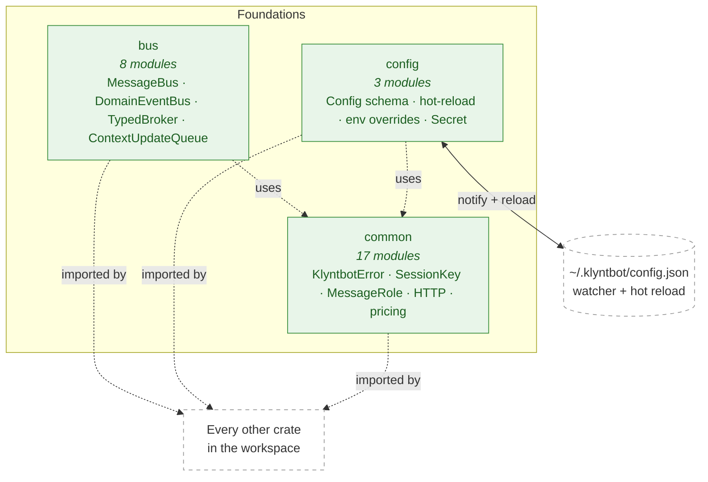

# Subsystem 01 — Foundations

> **Status:** 🟢 Stable
> **Status last verified:** 2026-05-16
> **Crates:** `common`, `config`, `bus`
> **Parent overview:** [`00-overview.md`](../00-overview.md)

---

## TL;DR

Three crates that every other crate in the workspace imports. **`common`** owns the error type (`KlyntbotError`), the strong newtypes (`SessionKey`, `ChannelName`, `ChatId`, `MessageRole`), and a grab bag of shared utilities (HTTP client, date parsing, pricing tables, notification ports). **`config`** owns the `Config` schema (camelCase JSON at `~/.klyntbot/config.json`), file I/O, hot-reload, and the `KLYNTBOT_...` env-override layer. **`bus`** owns the in-process pub/sub backbone — `MessageBus` (inbound/outbound chat), `DomainEventBus` (cross-feature events), `TypedBroker` (typed topic pub/sub), and `ContextUpdateQueue` (live agent-context refresh).

If any of these change, **everything downstream rebuilds.** Treat them like the C ABI of the workspace.

---

## Architecture diagram



---

## Mental model

Foundations sit at the bottom of the dependency stack. They have **three jobs**:

1. **Make impossible states unrepresentable.** Use `SessionKey` instead of `String`, `MessageRole` instead of a stringly-typed enum, `Secret<String>` for API keys. The type system prevents whole categories of bugs from ever compiling.
2. **Provide the one true error type.** Every crate returns `common::Result<T>` (alias for `Result<T, KlyntbotError>`). Domain errors auto-convert via `From`. A handler ten layers deep can `?` its way to the API boundary without manual translation.
3. **Be the only place pub/sub lives.** No crate rolls its own broadcast channel. Everything that needs to publish events goes through `bus` — usually `DomainEventBus` for cross-feature events, sometimes `MessageBus` for chat I/O.

Foundations is also **the only place to put truly cross-cutting utilities** — HTTP client construction, pricing tables, date parsing, the FSRS5 helpers in `memory.rs`. The bar for landing something here is high: it must be useful to ≥3 other crates and have no domain dependencies.

---

## Reference

### `common` — file map

| Path | Purpose |
|---|---|
| `src/lib.rs` | Module declarations + curated re-exports |
| `src/error.rs` | `KlyntbotError`, `ToolError`, `ProviderError`, `ChannelError`, `SessionError`, `ConfigError`, `Result<T>` |
| `src/types.rs` | `SessionKey`, `ChannelName`, `ChatId`, `MessageRole`, `AppMode`, channel string constants |
| `src/session_mode.rs` | `SessionMode` enum (`assistant` / `coding`) — creation-time, immutable |
| `src/prompts.rs` | `InteractionRequest`, `Question`, `Answer`, `AnswerOption`, `AnswerType`, `AnswerValue`, `FormResponse` (form-based agent ↔ user interaction) |
| `src/tool_channel.rs` | `Channel`, `ChannelMask` (bitfield for tool channel gating) |
| `src/http.rs` | `build_http_client`, `shared_http_client` — the only sanctioned `reqwest::Client` constructors |
| `src/date.rs` | `parse_datetime_jiff`, formatting helpers (UTC → local time conversions) |
| `src/time/` | Time-zone-aware utilities (Jiff-based) |
| `src/notify.rs` | OS notification types + helpers (`tauri-plugin-notification` bridge) |
| `src/pricing.rs` | LLM model price tables (USD per million tokens, in/out) |
| `src/memory.rs` | FSRS5 + salience helpers used by cognitive |
| `src/entity_card.rs` | `EntityCard` — generic entity reference (task/note/project/…) for cross-feature linking |
| `src/autotuner.rs` | `TrialParams` for A/B-style experiments |
| `src/coverage.rs` | Test coverage utilities |
| `src/helpers.rs` | `truncate_at_boundary`, `truncate_chars` (Unicode-safe truncation) |
| `src/ports.rs` | `NotificationSender` trait (dependency-inversion seam) |

### `KlyntbotError` — variants

```rust
pub enum KlyntbotError {
    Bus(String),
    BusDisconnected,
    Tool(ToolError),                  // Sub-enum: NotFound, InvalidParams, ExecutionFailed, PermissionDenied, HookBlocked
    Provider(ProviderError),          // Sub-enum: Http, InvalidResponse, ...
    Channel(ChannelError),
    Session(SessionError),
    Config(ConfigError),
    Cron(String),
    Storage(String),
    StorageNotFound(String),          // 404-shaped
    StorageConflict(String),          // 409-shaped
    NotImplemented(String),           // Phase-1 stub marker
    Io(std::io::Error),
    Json(serde_json::Error),
    Timeout(String),
    PermissionDenied(String),
    Cancelled(String),
    SessionAlreadyStreaming(String),  // double-send guard
}
```

**Key invariants:**
- `From<sqlx::Error>` lands in `KlyntbotError::Storage` (only when `sqlx` feature is on).
- `NotImplemented` is the canonical phased-stub marker (matches `coding-memory::NotImplementedInPhase`).
- `SessionAlreadyStreaming` is the double-send guard surfaced by `app-core::chat_send`.

### `config` — file map

| Path | Purpose |
|---|---|
| `src/lib.rs` | Re-exports |
| `src/loader.rs` | `init`, `load`, `load_sync`, `save`, `save_sync`, `reload_if_changed`, `config_dir`, `config_path` |
| `src/env.rs` | `load_with_env_overrides` — applies `KLYNTBOT_X__Y__Z` overlays after file read |
| `src/schema/mod.rs` | Top-level `Config` struct + 30+ sub-config modules |
| `src/schema/hot.rs` | `HotConfig`, `HotConfigDiff` — fields that take effect within the 5-second reload window |
| `src/schema/{telegram,discord,slack,email,mcp,finance,learning,…}.rs` | 30+ per-domain sub-configs |

### Config — top-level shape

```jsonc
// ~/.klyntbot/config.json (camelCase)
{
  "agents": { "defaults": { "model": "claude-opus-4-7", ... } },
  "providers": { "anthropic": { "apiKey": "<Secret>" }, "openai": { "apiKey": "<Secret>" } },
  "providerManager": { "primary": "anthropic", "fallback": [...] },
  "channels": { "telegram": {...}, "discord": {...}, "slack": {...}, "email": {...} },
  "mcp": { "server": { "exposedTools": [...] }, "clients": {...} },
  "finance": { "categories": [...], "budgeting": {...}, "fire": {...} },
  "learning": {...},
  "voice": {...},
  "todo": {...},
  "shortcuts": {...},
  "lifecycle": {...},
  "execution": {...},
  "packs": {...},
  "extendedThinking": {...},
  "wakeDelivery": {...},
  "cognitive": { "provider": "anthropic" /* used by Reforge */ },
  // ...
}
```

**Hot-reload semantics:**
- File watcher polls `config.json` mtime; on change, calls `reload_if_changed`.
- Fields in `HotConfig` (model, temperature, max_tokens, max_iterations, pipeline_timeout, monthly_budget) take effect within 5 seconds.
- Settings UI applies them **immediately** (writes file, triggers reload).
- Structural changes (channels, provider init, feature enable/disable) require **restart**.

**`Secret<String>`:**
- API keys are wrapped in `Secret<String>`. Access via `.expose()`.
- Prevents accidental `Debug` / `Display` leakage in logs.

**Env overrides:**
- `KLYNTBOT_AGENTS__DEFAULTS__MODEL=gpt-4o` → `config.agents.defaults.model = "gpt-4o"`.
- Applied **after** file load, **before** `Config` is returned.
- Double underscore = nested key.

### `bus` — file map

| Path | Purpose |
|---|---|
| `src/lib.rs` | Re-exports |
| `src/queue.rs` | `MessageBus` — async MPMC queue for `InboundMessage` / `OutboundMessage` (chat I/O) |
| `src/events.rs` | `InboundMessage`, `OutboundMessage`, `MessageKind` |
| `src/domain_events.rs` | `DomainEvent` enum, `DomainEventBus` (broadcast), `BashJobEvent`, `TodoEvent`, `TodoStatus`, `CodingMemoryKind`, `FeedbackResponse`, `CorrectionKind`, `ConcurrencyClass` |
| `src/typed_broker.rs` | `TypedBroker<T>` — single-type pub/sub with per-subscriber queues |
| `src/event_domain.rs` | `EventDomain` enum — categorizes events for routing |
| `src/context_updates.rs` | `ContextUpdate`, `ContextUpdateQueue`, `UpdatePriority`, `ContextUpdateReason` — drained by `LiveContextRefresher` at iteration boundaries |
| `src/injection.rs` | `DynamicInjector`, `InjectorContext`, `InjectorRegistry` — context injection plug-in points |
| `src/learning_events.rs` | `LearningEvent`, `LearningEventBus` — dedicated learning-specific event surface |

### Bus types at a glance

| Type | What it carries | Backed by |
|---|---|---|
| `MessageBus` | `InboundMessage` (channel → agent) / `OutboundMessage` (agent → channel) | `tokio::sync::mpsc` (MPMC via `Clone` of sender) |
| `DomainEventBus` | `DomainEvent` enum — task created/completed, alarm fired, bash-job event, todo event, coding-memory write, cron fired, etc. | `tokio::sync::broadcast` (fan-out; slow consumers can lag) |
| `TypedBroker<T>` | Single typed `T` | Per-subscriber queues; useful when broadcast lag is unacceptable |
| `ContextUpdateQueue` | `ContextUpdate` (with `UpdatePriority`) | MPSC; drained at iteration boundaries by `LiveContextRefresher` |
| `LearningEventBus` | `LearningEvent` | Broadcast |

**Why two MPMC patterns** (queue vs broker):
- `MessageBus` is MPMC because the same channel can have multiple consumers (e.g., persister + sender). Cloning the sender gives you a publisher.
- `DomainEventBus` is broadcast because **subscribers are independent** — cognitive, mirror, autotuner, activity-log all want every event without competing for it.

---

## Workflows

### Config hot-reload

```
1. Settings UI writes /Users/<you>/.klyntbot/config.json  (atomic write via temp file + rename)
   ↓
2. File watcher (polls mtime every N seconds) detects change
   ↓
3. config::loader::reload_if_changed() reads file + applies env overrides
   ↓
4. Diff against current Config:
   - Fields in HotConfig:   apply immediately (model, temperature, max_tokens, max_iterations, ...)
   - Fields NOT in HotConfig: require restart; logged at WARN with the field path
   ↓
5. HotConfigDiff broadcast on DomainEventBus
   ↓
6. Subscribers (AgentRuntime, ProviderManager, ChatPipeline, …) react
```

### Bus publish/subscribe (DomainEvent)

```rust
// Publisher (anywhere in the workspace)
domain_bus.publish(DomainEvent::TaskCompleted { task_id, completed_at, ... });

// Subscriber (typically in init code)
let mut rx = domain_bus.subscribe();
tokio::spawn(async move {
    while let Ok(event) = rx.recv().await {
        match event {
            DomainEvent::TaskCompleted { task_id, .. } => handle(task_id).await,
            _ => {}
        }
    }
});
```

**Lag handling:** `broadcast::Receiver::recv()` returns `Err(RecvError::Lagged(n))` when a subscriber falls behind. Standard pattern: log + continue (you've dropped `n` events).

### Error propagation

```rust
// In a leaf function
let row = repo.find(id).await
    .map_err(|e| KlyntbotError::Storage(e.to_string()))?;   // sqlx::Error → KlyntbotError

// In a handler
let result = self.do_thing().await?;                        // any KlyntbotError variant

// At the API boundary (Tauri command)
let outcome = appcore.do_thing(req).await
    .map_err(ApiError::from)?;                              // KlyntbotError → ApiError
```

The pattern is: **convert at boundaries, propagate the unified type internally.** No handler should match on `sqlx::Error` directly.

---

## Internals

### `SessionKey` format

`SessionKey` is stringified as `"{channel}:{chat_id}"`. Example: `telegram:123456`, `desktop:thread-abc`, `mcp:claude-code-session-xyz`. `SessionKey::split()` returns `Option<(ChannelName, ChatId)>` — used by stores/repos that need the parts.

### `ChannelMask` and tool-channel gating

`tool_channel::ChannelMask` is a bitfield representing the set of channels where a tool is allowed:
- `Channel::All` = visible in every channel
- `Channel::NonCoding` = visible in assistant-mode channels (telegram/discord/slack/email/desktop chat)
- `Channel::CodingOnly` = visible in coding-mode channels only

Tools declare `allowed_channels` on the `Tool` trait. The agent runtime filters the tool registry per-turn by the channel of the active session.

### `Secret<String>` is not opaque encryption

`Secret<String>` only blocks `Debug` and `Display` from leaking the value. It does **not** encrypt at rest — the API key sits in plaintext in `~/.klyntbot/config.json`. The threat model (see `SECURITY.md`) is "local single-user app"; an attacker with filesystem read access wins anyway.

### Why broadcast for `DomainEventBus`

The trade-off versus a queue: **broadcast loses events on slow consumers, queue blocks them.** For cross-feature notification (`TaskCompleted` published, mirror + cognitive + activity-log subscribed), it is acceptable for a lagging subscriber to drop an event — the data is also persisted in SQLite and the cognitive extraction can read backwards if needed. Blocking would create coupling between unrelated subsystems.

For data that **must not** be lost (e.g. user-typed chat messages), use `MessageBus` (MPMC queue) instead.

### `ContextUpdateQueue` ordering

`UpdatePriority` determines drain order at the iteration boundary. Standard priority = 80% of context-window budget; high priority = 90%. `pause_context_updates: true` on `ExecutionParams` freezes the queue for the turn (used for deterministic flows).

---

## Dependencies & extension points

### Upstream deps

- `tokio` (runtime)
- `serde` / `serde_json` (Config, events)
- `thiserror` (error derivation)
- `tracing` (logging)
- `reqwest` (HTTP client)
- `jiff` (date/time — newer than chrono, preferred for new code)
- `rust_decimal` (money math)
- `notify` (file-watcher for config hot-reload)

### Downstream consumers

Effectively every other workspace crate. The Cargo dependency graph shows `common` imported by all 60+ crates; `config` and `bus` are nearly as ubiquitous.

### Adding a new domain event

1. Add a variant to `bus::domain_events::DomainEvent` (in `crates/bus/src/domain_events.rs`).
2. Publishers call `domain_bus.publish(DomainEvent::YourVariant { ... })`.
3. Subscribers match it in their `recv()` loop. **Don't** add a new bus — add a variant.
4. If the event must not be lost (vs broadcast lag), use a `TypedBroker<YourEvent>` instead. Justify in a comment.

### Adding a new error variant

1. Prefer extending an existing sub-error enum (`ToolError`, `ProviderError`, …) over adding to `KlyntbotError` directly.
2. If you add to `KlyntbotError`, add the `#[error("...")]` formatting and a category (e.g. `StorageNotFound` is 404-shaped, `StorageConflict` is 409-shaped).
3. Audit `From` impls — if your variant could absorb a foreign error type, add the `From`.

### Adding a config field

1. Add to the right sub-config struct in `crates/config/src/schema/*.rs`.
2. Decide: hot-reloadable? If yes, add to `HotConfig` (`crates/config/src/schema/hot.rs`).
3. Add a default in `#[serde(default)]` so existing configs don't break on load.
4. Document at `~/.klyntbot/config.json` example level in `00-overview.md`'s storage section if it's user-facing.

---

## Open questions & debt

- **HTTP client construction is in `common`** but providers/channels also have specific TLS/auth needs. Today each adapter builds its own `reqwest::Client` on top of `common::shared_http_client`. Consider a `HttpClientFactory` trait if customization grows.
- **No structured logging events** — `tracing` is plain text. Per `00-overview.md` non-goals, this is intentional, but be aware when adding telemetry-shaped log lines that there's no consumer pipeline.
- **`ChannelMask` bitfield** versus enum: bitfield wins because tools may want multiple channels but not "all" (e.g., assistant + MCP but not coding). Watch for misuse: today most tools use a single named variant; the bitfield flexibility is untapped.

See [`TECH_DEBT.md`](../TECH_DEBT.md) categories #1, #5, #6 for specific items touching this subsystem.

---

## Cross-references

- [`02-storage.md`](./02-storage.md) — consumes `common::Result`, `SessionKey`
- [`03-providers.md`](./03-providers.md) — consumes `common::Result`, `Secret`, `ProviderError`
- [`04-agent-runtime.md`](./04-agent-runtime.md) — consumes `MessageBus`, `DomainEventBus`, `ContextUpdateQueue`
- [`05-cognitive-memory.md`](./05-cognitive-memory.md) — subscribes to `DomainEventBus`; uses `common::memory` FSRS helpers
