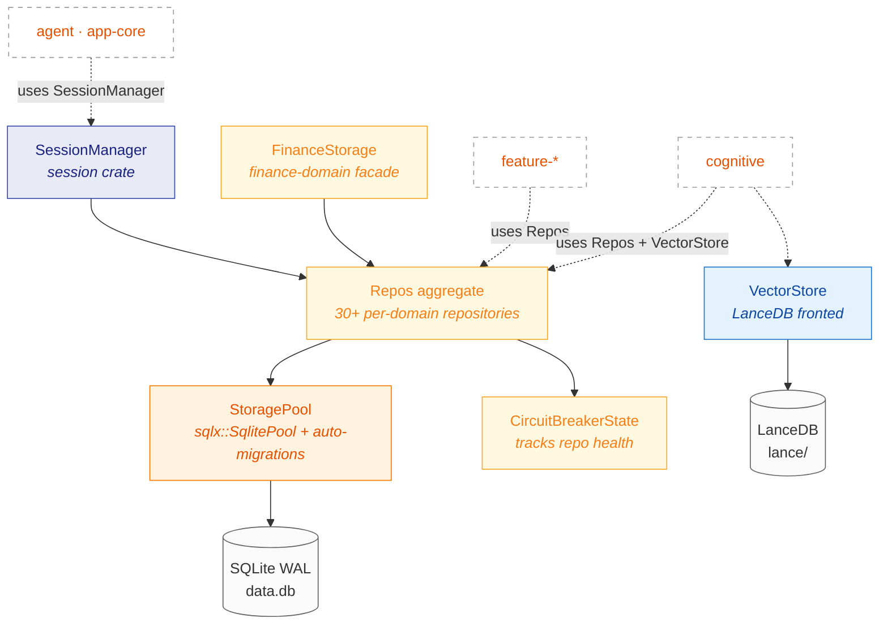

# Subsystem 02 — Storage & Persistence

> **Status:** 🟢 Stable
> **Status last verified:** 2026-05-16
> **Crates:** `storage`, `session`
> **Parent overview:** [`00-overview.md`](../00-overview.md)

---

## TL;DR

`storage` is the **only** crate that talks to SQLite or LanceDB. Everything else goes through it. The entry point is `StoragePool` — a `Clone + Send + Sync` newtype around `sqlx::SqlitePool` that auto-runs migrations on connect. The `Repos` aggregate (`storage::Repos`) hands out 30+ per-domain repositories. Vectors live in LanceDB under `~/.klyntbot/lance/`, fronted by `storage::VectorStore`. Tests use `StoragePool::connect_in_memory()` — no fixture databases.

**`session`** is a thin facade on top of `storage::SessionRepo`. It exists to give the agent runtime a cleaner per-session API (`SessionManager`, `Session`, `SessionInfo`, `SessionMessage`) without making it touch SQL types.

---

## Architecture diagram



---

## Mental model

Storage is **the only crate with a SQL dependency in its Cargo.toml**. If you find yourself reaching for `sqlx` outside `storage`, stop — the design is for that data type to live in a `*Repo` here, not in your feature crate.

The split between `storage` and `session`:

- **`storage`** is the raw persistence layer. Knows about rows, repos, migrations, pooling, sql types.
- **`session`** is a domain layer for conversation sessions specifically. It uses `SessionRepo` underneath but presents domain objects (`Session`, `SessionMessage`, `SessionInfo`) instead of `SessionRow`.

You'll use `storage` directly almost everywhere. `session` is mainly for the agent runtime, which wants conversation semantics rather than SQL semantics.

### Why one giant aggregate (`Repos`) instead of dependency injection

`Repos` is a `struct` with 30+ public fields, one per repo. It is constructed once via `Repos::from_pool(&pool)` and passed around as `&Repos` or `Arc<Repos>`. The alternative (per-repo trait injection) would multiply constructor args at every layer. The aggregate trades a little coupling for a lot less plumbing — acceptable for a single-user app.

### Why upward dependency on `ai-core`

This is the anomaly flagged in [`00-overview.md`](../00-overview.md#3-migration-debt-in-flight) and [`TECH_DEBT.md`](../TECH_DEBT.md#7-architectural-anomalies). `storage/Cargo.toml:7` has `ai-core.workspace = true`. The reason is that some `*Row` types need to materialize `ai-core` trait objects, but `ai-core` is logically higher up the stack. The fix is either (a) move the small set of `ai-core` traits down to `common`, or (b) split `storage` into a low-level `storage-core` plus a higher-level shim that knows about `ai-core`. Neither has been done.

---

## Reference

### `storage` — file map

| Path | Purpose |
|---|---|
| `src/lib.rs` | Module declarations + ~80 re-exports |
| `src/pool.rs` | `StoragePool`, `DataVersionWatcherHandle`, `connect`, `connect_in_memory`, `from_existing`, `run_feature_migrations`, `optimize` |
| `src/error.rs` | `StorageError`, `OptionExt` (helper for `Option → Result<_, NotFound>` conversion) |
| `src/macros.rs` | `#[macro_use]`-imported helpers for repo definitions |
| `src/sqlite_types.rs` | `SqlDate`, `SqlTs` (newtypes for `jiff::Timestamp` ↔ SQLite TEXT/INTEGER) |
| `src/circuit_breaker.rs` | Global circuit breaker state (persists a single open-until deadline across restarts) |
| `src/finance_storage.rs` | `FinanceStorage` — facade combining 9 finance repos for atomic finance ops |
| `src/messages/` | `MessagePart` enum, `MessagePartsRow`, parts↔content mirroring |
| `src/repos/` | 50+ `*Repo` modules — see [Repository directory](#repository-directory) |
| `src/rows/` | 30+ `*Row` structs — `sqlx::FromRow` deserialization targets |
| `src/vector_store/` | `VectorStore`, LanceDB integration, `CognitiveFactParams` query helpers |
| `migrations/` | Built-in SQL migrations (run on `StoragePool::connect`) |

### `StoragePool` API

```rust
impl StoragePool {
    // Production
    pub async fn connect(data_dir: &Path) -> Result<Self, StorageError>;

    // Tests + fallback
    pub async fn connect_in_memory() -> Result<Self, StorageError>;

    // Wrap an already-migrated pool (skips migrations)
    pub fn from_existing(pool: sqlx::SqlitePool) -> Self;

    // Run feature-owned migrations not in `migrations/`
    pub async fn run_feature_migrations(
        pool: &sqlx::SqlitePool,
        migrations: &[tools_core::FeatureMigration],
    ) -> Result<(), StorageError>;

    pub fn inner(&self) -> &sqlx::SqlitePool;
    pub async fn optimize(&self) -> Result<(), StorageError>;
}
```

### SQLite PRAGMAs (set automatically)

| PRAGMA | Value | Why |
|---|---|---|
| `foreign_keys` | `ON` | Per-connection — enforces FK constraints |
| `busy_timeout` | `5000` ms | Per-connection — handles WAL contention |
| `cache_size` | `-2000` (≈2MB) | Per-connection — single-user app; default 8MB is overkill |
| `journal_mode` | `WAL` | Pool-level (once) — required for concurrent readers |
| `wal_autocheckpoint` | `1000` pages (≈4MB) | Pool-level — prevents unbounded WAL growth |

**Max connections:** 5. Single-user workload doesn't need more; helps cap memory.

### Repository directory

The full set of repos (in `crates/storage/src/repos/`). Organized by domain:

| Domain | Repos |
|---|---|
| **Sessions / chat** | `SessionRepo`, `SessionContextRepo`, `SessionMemoryRepo`, `SubagentInstanceRepo` |
| **Tasks / projects / OKR** | `TaskRepo`, `TaskGroupRepo`, `TaskRecurrenceRepo`, `TaskAlarmsRepo`, `ProjectRepo`, `ProjectSourceRepo`, `AreaRepo`, `ObjectiveRepo`, `KeyResultRepo`, `EntityLinkRepo`, `CustomColumnRepo`, `StatusWorkflowRepo` |
| **Notes / knowledge** | (consumed via `feature-notes` repo set — `NoteRepo`, `NotebookRepo`, `EntityMentionRepo`) |
| **Finance** | `FinanceAccountRepo`, `FinanceTransactionRepo`, `FinanceBudgetRepo`, `FinanceGoalRepo`, `FinanceLiabilityRepo`, `FinanceInvestmentRepo`, `FinanceAllocationRepo`, `FinanceSnapshotRepo`, `FinanceExchangeRateRepo` + `FinanceStorage` facade |
| **Productivity** | `DndOverrideRepo`, `BashJobRepo` (background coding jobs) |
| **Cognitive / learning** | `StrategyRepo`, `LearningStateRepo`, `OutcomeRepo`, `DecisionLogRepo`, `InteractionLogRepo`, `RetrievalFeedbackRepo`, `BrainSignalRepo`, `ReforgeSuggestionRepo`, `ReforgeStateRepo`, `SkillVersionRepo` |
| **Coaching / coding** | `CoachingStrategyRepo`, `CoachingInterventionLogRepo`, `CodingApprovalHistoryRepo`, `CodingTodoRepo`, `CodingReviewsRepo`, `CodingBackgroundJobsRepo`, `ApprovalPatternHistoryRepo` |
| **Tools / observability** | `ToolUsageRepo`, `ResponseWarningRepo`, `UsageRepo` (token + cost tracking) |
| **Scheduling / alerts** | `CronRepo`, `ScheduledFiresRepo`, `HeldNotificationsRepo`, `NotificationLogRepo` |
| **Autotuner** | `TrialRepo` |
| **Agent tasks (deep agentic)** | `AgentTaskRepo` |

### `VectorStore` (LanceDB)

- One LanceDB database per `data_dir` (`{data_dir}/lance/`).
- Tables created on demand: `episodic_memory`, `semantic_memory`, `notes_embeddings`, etc.
- `CognitiveFactParams` is the typed query surface used by cognitive.
- `sanitize_predicate_value` — prevents Lance SQL injection in predicate filters.
- Migrations: LanceDB doesn't have a formal migration system. Schema is validated on open; mismatch triggers an in-place rebuild path (see `vector_store/mod.rs:112` — handles the legacy `full_content` column case).

### `session` — file map

| Path | Purpose |
|---|---|
| `src/lib.rs` | Re-exports |
| `src/manager.rs` | `Session`, `SessionManager`, `SessionInfo`, `SessionMessage` |

The `session` crate is intentionally tiny. Reads go through `SessionRepo`; writes too. The crate exists so consumers don't need to know about `SessionRow` or `MessagePart` SQL details.

---

## Workflows

### Writing a new message (with legacy mirror)

```
1. AppCore::chat_send(thread, msg)
   ↓
2. SessionRepo::add_message(session_key, msg_id, role, content, parts, ...)
   ↓
3. INSERT INTO messages (session_key, msg_id, role, content, parts, ...)
   - `content`: legacy String mirror of Text parts (joined with "\n")
   - `parts`: JSON column with structured MessagePart array
   - Both written atomically in the same INSERT
   ↓
4. DomainEvent::MessageStored published on bus
```

**Why the legacy `content` mirror is still here:** Anthropic-shape compatibility — some readers still consume the flat `content` column. Reads fall back to wrapping legacy `content` in a `Text` part when `parts IS NULL`. This is migration debt — see [`TECH_DEBT.md`](../TECH_DEBT.md#3-legacy-code-paths-in-active-use).

### Running migrations on startup

```
StoragePool::connect(data_dir)
   ↓
1. Create directory if missing
2. Connect with PoolOptions { max_connections: 5 }
3. after_connect hook: set foreign_keys, busy_timeout, cache_size PRAGMAs
4. Pool-level PRAGMAs: journal_mode=WAL, wal_autocheckpoint=1000
5. sqlx::migrate!("./migrations").run(&pool).await
   - Reads files in storage/migrations/ in lexicographic order
   - Tracks applied migrations in _sqlx_migrations table
   - Each file runs in its own transaction
6. Return StoragePool
   ↓
Feature crates can later call StoragePool::run_feature_migrations(&pool, &[FeatureMigration{...}])
   - Each FeatureMigration has feature_name + version + sql
   - Wrapped in explicit transaction (SQL + tracking INSERT both succeed or both fail)
   - Duplicate (feature_name, version) panics with descriptive message
```

### Vector search (semantic memory example)

```
1. cognitive::SemanticMemoryService::search(query_text)
   ↓
2. Embed query via providers (returns Vec<f32>)
   ↓
3. VectorStore::search(table="semantic_memory", embedding, top_k, predicate?)
   ↓
4. LanceDB returns ranked rows (with cosine distance scores)
   ↓
5. Optionally re-rank via PPR (PersonalizedPageRank) — happens in cognitive layer
   ↓
6. Hydrate full memory rows via SemanticMemoryRepo (SQLite)
   ↓
7. Return to caller
```

### In-memory testing pattern

```rust
#[tokio::test]
async fn my_repo_test() {
    let pool = StoragePool::connect_in_memory().await.unwrap();
    let repos = Repos::from_pool(&pool);

    repos.task_repo.insert(...).await.unwrap();
    let got = repos.task_repo.find(...).await.unwrap();
    assert_eq!(got.title, "...");
}
```

**No fixture DBs ever** — every test connects fresh. Tests run in parallel via `cargo nextest` because each has its own ephemeral pool.

---

## Internals

### `Repos::from_pool(&pool)` is cheap

`Repos` construction just `.clone()`s the `StoragePool` (which is itself a `.clone()` of `Arc<sqlx::SqlitePool>`). No connections opened, no queries run. Safe to construct per-handler or per-request.

### Circuit breaker

`circuit_breaker.rs` is a simple global deadline persistence layer. It stores a single `open_until_utc` timestamp in SQLite; if present, the breaker is "open" until that time. There is no per-repo tracking, no failure counting, and no half-open probe logic. The actual circuit-breaker behavior (counting failures, deciding when to open) lives upstream in the `ProviderManager` (`crates/providers/src/manager.rs`).

### `FinanceStorage` facade

`FinanceStorage` (in `crates/storage/src/finance_storage.rs`) wraps the 9 finance repos behind a single object. It exists because finance operations frequently touch multiple tables atomically (a transaction inserts a row in `finance_transactions`, updates `finance_accounts.balance`, and may bump `finance_budgets.spent` — all in one tx). Doing that with separate repos would require passing `&mut Transaction<'_, Sqlite>` everywhere; the facade absorbs it.

### `DataVersionWatcherHandle`

Optional background task that polls `data.db`'s `data_version` PRAGMA. When it increments (another process wrote — usually the MCP server child), notifies subscribers. **Used by the desktop app to refresh UI state when the MCP child mutates tasks/notes via tool calls.** Dropping the handle cancels the watcher (via the embedded `CancellationToken`).

### Concurrency model

- **Reads:** Concurrent (WAL mode allows multiple readers).
- **Writes:** Serialized per-connection but `max_connections=5` allows ~5 concurrent in-flight. SQLite serializes them internally.
- **Cross-process:** WAL allows the desktop app and the MCP child to share `data.db`. Both are wired through `StoragePool::connect`.

---

## Dependencies & extension points

### Upstream deps

- `sqlx` (SQLite driver, `runtime-tokio-rustls` features)
- `lance` + `lancedb` (vector store)
- `jiff` (timestamps)
- `tokio` (runtime, broadcast for the data-version watcher)
- `common` (error types, newtypes)
- `ai-core` (the upward dependency — see anomaly above)
- `tools-core` (only for `FeatureMigration`)

### Adding a new repo

1. Create `crates/storage/src/rows/my_thing.rs` with `MyThingRow` and `#[derive(sqlx::FromRow)]`.
2. Create `crates/storage/src/repos/my_thing_repo.rs` with `MyThingRepo` struct. Constructor takes `StoragePool`. Methods are `async`, return `Result<T, StorageError>`.
3. Add field to `Repos` struct in `crates/storage/src/repos/mod.rs` and construct in `Repos::from_pool`.
4. Re-export from `crates/storage/src/lib.rs`.
5. Add migration SQL in `crates/storage/migrations/NNN_add_my_thing.sql` (built-in) OR in a `FeaturePackage::migrations()` (per-feature).
6. **Pre-release rule:** You can alter existing migration files in place (no users to migrate). Post-1.0, every change becomes a new migration file with `INSERT OR IGNORE` for idempotency.

### Adding a vector-backed memory type

1. Add the LanceDB table name to your service (no global registry).
2. Use `VectorStore::create_table_if_missing(name, schema)` once on startup.
3. Define a typed query params struct (see `CognitiveFactParams` as the template).
4. Embed via `providers` and write via `VectorStore::insert(...)`.
5. Read via `VectorStore::search(...)`.

### Adding a feature migration

`tools_core::FeatureMigration` has `feature_name: String`, `version: i64`, `sql: String`. Apply via `StoragePool::run_feature_migrations(&pool, &migrations)` typically from your `FeaturePackage::migrations()`:

```rust
impl FeaturePackage for MyFeature {
    fn migrations(&self) -> Vec<FeatureMigration> {
        vec![FeatureMigration {
            feature_name: "my_feature".into(),
            version: 1,
            sql: include_str!("../migrations/001_initial.sql").into(),
        }]
    }
}
```

Tracking lives in the `feature_migrations` table — keyed on `(feature_name, version)`. **Duplicate (feature_name, version) panics on startup** with a descriptive message — you'll see it in the dev console.

---

## Open questions & debt

- **`storage` depends upward on `ai-core`** — [P1 anomaly](../TECH_DEBT.md#7-architectural-anomalies). Decide direction-of-flow fix.
- **Legacy `content` column mirror** — every message write does double work; reads still fall back. Plan: deprecate once all consumers read from `parts` only.
- **Vector-store migration story is informal** — LanceDB schema mismatch triggers in-place rebuild rather than versioned migration. Acceptable today; will need a real story when external schemas appear.
- **No structured query API for the vector store** — every consumer hand-writes predicates. `CognitiveFactParams` is the template; could be generalized.
- **The `BashJobRepo` lives in storage** even though it's coding-only. Could move to `coding-memory` or `feature-coding-bash` for crate hygiene.

See [`TECH_DEBT.md`](../TECH_DEBT.md) categories #3 (legacy paths) and #7 (architectural anomalies) for specifics.

---

## Cross-references

- [`01-foundations.md`](./01-foundations.md) — the `KlyntBotError`, `Result`, `SessionKey` types
- [`04-agent-runtime.md`](./04-agent-runtime.md) — uses `SessionManager` and `SessionRepo`
- [`05-cognitive-memory.md`](./05-cognitive-memory.md) — heavy `VectorStore` + cognitive repo user
- [`07-tools-framework.md`](./07-tools-framework.md) — `FeatureMigration` definition lives there
- [`08-assistant-features.md`](./08-assistant-features.md) — every feature crate gets repos via `Repos::from_pool`
