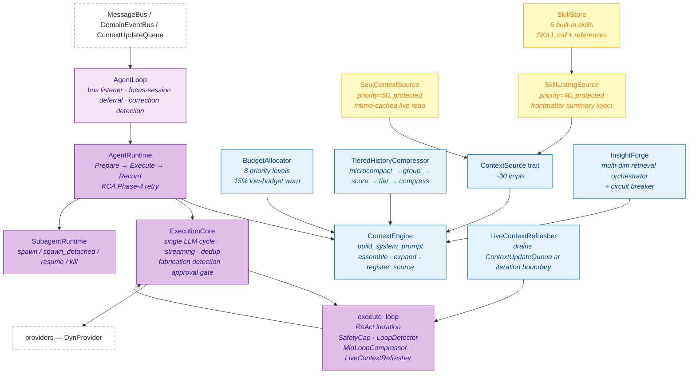

# Subsystem 04 — Agent Runtime

> **Status:** 🟡 In Progress (flat-runtime migration; vestigial intent fields)
> **Status last verified:** 2026-05-16
> **Crates:** `agent`, `context_engine`, `skill-system`
> **Parent overview:** [`00-overview.md`](../00-overview.md)

---

## TL;DR

The runtime that turns "a user sent a message" into "a final response." `agent` owns the message bus loop (`AgentLoop`), the per-turn pipeline (`AgentRuntime`), the single LLM-call cycle (`ExecutionCore`), the ReAct loop with cancellation and mid-loop compression (`execute_loop`), the subagent system (`SubagentRuntime`), and ~30 `ContextSource` implementations. `context_engine` is the token-budgeted assembly + retrieval layer — budget allocator, tiered history compressor, query enhancement pipeline, `ContextSource` trait, `MemoryRetriever`, `TokenCounter` abstractions. `skill-system` is small but central: it loads 6 built-in skills, parses `.md` frontmatter, and exposes the **soul** (`KLYNTBOT.md`/`KLYNTBOT-coding.md`) as the highest-priority context source.

**The runtime is now fully flat** — there is no `SkillRouter` performing keyword + semantic classification. All skills are injected as compact frontmatter listings and the model loads full bodies on demand via the `skill_reference` tool. Earlier docs (CLAUDE.md, the old overview) describe an algorithm that no longer exists.

---

## Architecture diagram



---

## Mental model

The agent runtime has **three layers** of progressively finer-grained loops:

1. **`AgentLoop`** — long-lived service that listens to the message bus. One per process. Wraps focus-session deferral (buffers inbound messages when a focus session is active and sends a single auto-reply), correction/memory-miss detection, and dispatch to either chat or direct paths.
2. **`AgentRuntime`** — per-turn pipeline. **Three phases**: Prepare (build system prompt + context), Execute (call `execute_loop`), Record (persist outcomes + KCA Phase-4 retry on memory refusal). Mostly stateless beyond a few `Arc`s — runs concurrently for many turns.
3. **`execute_loop`** — the ReAct iteration. Calls `ExecutionCore::run_cycle` per iteration; between cycles applies mid-loop compression, drains the context-update queue, and checks safety caps + loop-repeat detection. Has explicit cancellation via `tokio::select!` per chunk.

Then beneath those, **`ExecutionCore::run_cycle`** is the atomic unit: one streaming LLM call, possibly with `MAX_CONCURRENT_TOOLS=10` parallel tool calls afterward, with optional approval-gate check per call.

### Two important non-obvious facts

- **The main agent has no turn cap.** `SafetyCap::new(depth)` always sets `max_turns = u32::MAX` (verified in `crates/agent/src/execution/budget.rs`). Only `SafetyCap::with_limits` (used by `SubagentRuntime` and coding review) sets a real cap (subagents default to `DEFAULT_TURN_CAP = 500` at `subagent_runtime.rs:21`). If the main agent ever loops, the only stops are `LoopDetector` (HardStop at 5 repeats of the same `(tool_name, args_hash)`) or the budget allocator running out, or user cancellation.
- **The runtime is fully flat.** `SourceContext::intent_summary` exists but is always `None` — the runtime stopped populating it. The `intent_pipeline` module that CLAUDE.md describes does not exist. Skill selection happens implicitly: all skill summaries get injected, the model chooses, then loads full bodies via the `skill_reference` tool.

### Two compressors, two purposes

| Compressor | Where | When | What it does |
|---|---|---|---|
| `TieredHistoryCompressor` | `context_engine`, called at context assembly | Per turn, before LLM call | Groups history into turns, scores, assigns tiers (Detailed/Condensed), batches compression in groups of 5, extractive-first with LLM fallback |
| `MidLoopCompressor` | `agent::execution`, called inside `execute_loop` | Per iteration, after each tool round, if message tokens > 70% of context window | Replaces older `Message::Tool` results with 150-char extractive snippets; preserves `MIN_RECENT_MESSAGES=8` tail verbatim; drops image parts (lossy) |

They are intentionally distinct: TieredHistoryCompressor is the "prepare context for this LLM call" pass; MidLoopCompressor is the "we've been looping and now we're crowding the window" pass. The naming hides their interaction — it's worth knowing they can both fire on the same turn.

---

## Reference

### `agent` — file map (selected)

| Path | Purpose |
|---|---|
| `src/lib.rs` | Module declarations + re-exports |
| `src/agent_loop/mod.rs` | `AgentLoop` — message bus listener, focus deferral, correction detection |
| `src/agent_loop/builder.rs` | Builder that wires every dependency together at startup |
| `src/agent_runtime/runtime.rs` | `AgentRuntime` — per-turn 3-phase pipeline + KCA Phase-4 retry |
| `src/execution/core.rs` | `ExecutionCore` — single LLM cycle, streaming, dedup, fabrication detection, approval gate |
| `src/execution/execute_loop.rs` | `execute_loop` — the ReAct iteration |
| `src/execution/budget.rs` | `SafetyCap`, `DepthMode` (Normal/DeepThink/Ultra) |
| `src/execution/types.rs` | `ExecutionParams`, `CycleOutcome`, `ToolExecutionResult`, `LoopFinishReason` |
| `src/execution/mid_loop_compressor.rs` | `MidLoopCompressor` (constants: `COMPRESSION_THRESHOLD = 0.70`, `MIN_RECENT_MESSAGES = 8`, `MIN_COMPRESSIBLE_TOKENS = 50`) |
| `src/execution/live_context_refresher.rs` | `LiveContextRefresher` — drains `ContextUpdateQueue` at iteration boundary |
| `src/execution/loop_detector.rs` | `LoopDetector` — Warning at 3 repeats, HardStop at 5 |
| `src/execution/cache_policy.rs` | Cache breakpoint placement (`compression_aware_default`) |
| `src/subagent_runtime.rs` | `SubagentRuntime`, `ActiveSubagentRegistry`, `DEFAULT_TURN_CAP = 500` |
| `src/subagent.rs` | `run_subagent_loop` + per-invocation `AgentTaskTool` clone |
| `src/subagent_events.rs` | `SubagentLifecycleEvent` |
| `src/events.rs` | `AgentEvent` enum — every streaming event |
| `src/context_sources/*` | Per-domain `ContextSource` implementations |
| `src/adapters/llm_summary.rs` | `LlmSummaryProvider` — batch LLM abstractive compression |
| `src/adapters/cognitive_handlers.rs` | Cognitive bridge adapters (incl. `LlmQueryPredictorHandler` for KCA Track 7) |
| `src/confidence/*` | `ConfidenceEvaluator`, `DecisionLogger` |
| `src/learning/*` | `LearningService`, `InteractionRecorder`, `OutcomeRecorder` |
| `src/output/cost_tracker.rs` | Per-model cost accounting + session ceiling |
| `src/output/validator.rs` | `ResponseValidator` — length truncation, system-leak detection, `detect_memory_refusal` |

### `context_engine` — file map (selected)

| Path | Purpose |
|---|---|
| `src/lib.rs` | Re-exports |
| `src/assembler/mod.rs` | `ContextEngine` — orchestrator |
| `src/assembler/cache.rs` | `ContextCache` — LRU |
| `src/assembler/types.rs` | `ContextRequest`, `AssembledContext`, `ExecutionStrategy`, `CompressionStats` |
| `src/budget.rs` | `BudgetAllocator`, `BudgetConfig`, `Priority` (8 levels), `LOW_BUDGET_THRESHOLD = 0.15` |
| `src/history_compressor/tiered.rs` | `TieredHistoryCompressor` (the per-turn compression entry) |
| `src/history_compressor/{grouping,snippet,types,mod}.rs` | Turn grouping, snippet extraction, `ConversationTurn`, `TierSummary`, `CompressedHistory`, `CompressionTier` |
| `src/source.rs` | `ContextSource` trait + `SourceContext` |
| `src/enhancement/{pipeline,prf,heuristic_rerank,mod}.rs` | `QueryPipeline`, `RankingPipeline`, PRF stage, heuristic reranker |
| `src/insight_forge/{mod,circuit_breaker,decomposer,llm_decomposer}.rs` | Multi-dim retrieval orchestrator |
| `src/memory_retriever.rs` | `MemoryRetriever` trait + `MemoryEntry`, `MemorySource` |
| `src/memory_scorer.rs` | `MemoryScorer` trait (cognitive scoring entry) |
| `src/token_counter.rs` | `TokenCounter` trait + `CharTokenCounter`, `AnthropicTokenCounter`, `TiktokenCounter` |
| `src/summary_provider.rs` | `SummaryProvider` trait |
| `src/ttl_cache.rs` | Generic `TtlCache` |
| `src/inventory.rs` | `ContextInventory` for deferred source tracking |
| `src/rewriter.rs` | `RetrievalContext`, `CorrectionContext`, `UserSituationSnapshot`, `ActiveView` |

### `skill-system` — file map

| Path | Purpose |
|---|---|
| `src/lib.rs` | Re-exports |
| `src/store.rs` | `SkillStore` — loads `.md` / `SKILL.md` from disk; installs 6 built-in defaults; `MAX_DESCRIPTION_CHARS = 250` |
| `src/listing.rs` | `SkillListingSource` — `ContextSource` impl (priority 40, protected) |
| `src/soul.rs` | `SoulContextSource` — live-reads `KLYNTBOT.md` / `KLYNTBOT-coding.md` with mtime caching; `DEFAULT_SOUL` + `DEFAULT_CODING_SOUL` consts |
| `src/defaults.rs` | `compiled_skill_defaults()` — returns all compiled skill content |
| `src/parser.rs` | `split_frontmatter` |
| `src/persona.rs` | `parse_persona_skill`, `ParsedPersonaSkill`, `PersonaSkillMetadata` |
| `src/types.rs` | Shared types |

### 6 built-in orchestrator skills

Compiled into `SkillStore` via `DEFAULT_SKILLS` in `store.rs:18`:

1. `task-management`
2. `finance-management`
3. `automation`
4. `notebook`
5. `learning`
6. `coding-orchestrator`

(CLAUDE.md says 5. The 6th — `coding-orchestrator` — was added but not documented.)

### Key constants (with file:line)

| Constant | Value | Location | Notes |
|---|---|---|---|
| `MAX_CONCURRENT_TOOLS` | `10` | `agent/src/execution/core.rs:60` | Global semaphore for parallel tool fan-out |
| `MAX_TOOL_RESULT_LENGTH` | `50_000` bytes | `agent/src/execution/core.rs:65` | Truncated past this |
| `LONG_RUNNING_TOOL_TIMEOUT` | `600 s` | `agent/src/execution/core.rs:54` | Only for interactive tools (`ask_user`). **Not** named `INTERACTIVE_TOOL_TIMEOUT` as CLAUDE.md says. |
| Default `tool_timeout` | `30 s` | `agent/src/execution/types.rs:74` | Set on `ExecutionParams` |
| `COMPRESSION_THRESHOLD` | `0.70` | `agent/src/execution/mid_loop_compressor.rs:15` | Fraction of context window |
| `MIN_RECENT_MESSAGES` | `8` | `agent/src/execution/mid_loop_compressor.rs:18` | Preserved verbatim by MidLoopCompressor |
| `MIN_COMPRESSIBLE_TOKENS` | `50` | `agent/src/execution/mid_loop_compressor.rs:24` | Tool results smaller than this aren't worth compressing |
| `DEFAULT_TURN_CAP` (subagents) | `500` | `agent/src/subagent_runtime.rs:21` | Main agent has NO turn cap |
| `LOW_BUDGET_THRESHOLD` | `0.15` | `context_engine/src/budget.rs:7` | Warn when remaining tokens < 15% |
| `MAX_DESCRIPTION_CHARS` (skill listing) | `250` | `skill-system/src/store.rs:14` | Truncates frontmatter `description` for inject |
| `CORRECTION_WINDOW_MINUTES` | `15` | `agent/src/agent_loop/mod.rs:27` | Trial repo retroactive correction window |

**Not constants — provider-supplied:**
- Context window comes from `RuntimeConfig.context_window`. There is no `ANTHROPIC_CONTEXT_WINDOW` constant — CLAUDE.md and my earlier overview were wrong.

### Runtime tunables (config-driven)

Cognitive runtime values live under `config.cognitive` in `config.json` — see [`crates/config/src/schema/cognitive.rs`](../../../crates/config/src/schema/cognitive.rs). The two most commonly overridden:

- `cognitive.episodicImportanceThreshold` (default `0.7`) — importance score below which observations don't become persistent episodic memories
- `cognitive.openaiEmbeddingModel` (default `"text-embedding-3-small"`)

The 11 `KCA_*` env-var feature flags that previously gated runtime behavior were removed on 2026-05-17. See [Subsystem 14 — "Follow-up: all `KCA_*` env vars removed"](./14-validation.md#follow-up-all-kca_-env-vars-removed) for the per-flag fate.

---

## Workflows

### Per-iteration ReAct flow (inside `execute_loop`)

```
loop {
    1. Cancellation token check (top of loop)
    2. SafetyCap gate (turn cap + token cap — hard abort, no synthesis)
    3. Emit AgentEvent::IterationStart
    4. Compute cache breakpoints via cache_policy::compression_aware_default
    5. ExecutionCore::run_cycle
       a. Stream LLM response chunks
       b. On tool_use blocks: parallel execute (MAX_CONCURRENT_TOOLS=10),
          partitioned by is_concurrency_safe — safe in join_all, unsafe sequentially
       c. Approval gate per tool call (if ApprovalGate present)
       d. Dedup tool calls via seen_tool_calls HashSet
       e. Fabrication detection (skipped in coding mode)
    6. Accumulate usage, tick turn, call on_iteration callback (subagent heartbeat)
    7. Match CycleOutcome:
       - FinalResponse / FabricatedResponse → return
       - ToolsExecuted → LoopDetector.check (Warning@3, HardStop@5)
       - EmptyResponse → treat as self-stop
       - Cancelled → return partial
    8. MidLoopCompressor.compress_if_needed (fires PreCompact/PostCompact hooks)
    9. LiveContextRefresher.inject_pending_with_ctx
       (drains ContextUpdateQueue + InjectorRegistry::collect_all)
   10. Emit AgentEvent::BudgetUpdate
}
```

### `TieredHistoryCompressor` pipeline (per-turn compression)

```
1. Early exit if turn count ≤ tier0_count (the "always-keep-recent" boundary)
3. Microcompact pre-pass:
   - For COMPACTABLE_TOOLS (read_file, bash, grep, glob, web_search, web_fetch)
   - Outside the tier0_count × 2 window
   - Replace results with 150-char snippet
4. group_into_turns → split into ConversationTurn objects at tier0_start
5. Optional cognitive scoring via MemoryScorer::score_batch (if use_cognitive_scoring enabled)
6. Tier assignment:
   - Detailed: high score (≥ high_relevance_threshold) OR within recency window
   - Condensed: otherwise
7. compress_turns:
   - Batch consecutive same-tier turns (sub-batches of 5)
   - Extractive-first; only call LLM when extractive output exceeds target_ratio × original_tokens
   - Skip turns < 30 tokens
8. Return CompressedHistory { summaries, recent_messages, preamble, total_tokens }
```

### Subagent spawn

```
spawn vs spawn_detached:
  spawn:
    - synchronous, blocks until loop completes
    - returns SubagentRunResult
  spawn_detached:
    - async setup (insert DB rows, register cancel token, emit Spawned)
    - tokio::spawn the loop
    - returns (agent_id, session_id) immediately

Both:
  - SafetyCap::with_limits(DEFAULT_TURN_CAP=500)
  - Clone cached base tool registry
  - Append fresh AgentTaskTool bound to this invocation's task claim
  - Register in ActiveSubagentRegistry (DashMap<String, CancellationToken>)
```

### Predictive cache warming (KCA Track 7)

After each completed turn, `AgentRuntime` fires a detached `tokio::spawn` that:
1. Calls `LlmQueryPredictorHandler::predict_next` to generate `predictions_per_turn` (default 3) follow-up queries.
2. Pre-retrieves memories for each predicted query.
3. Stores them in `PredictiveCache`.
4. Cache hits on the next actual turn skip the full retrieval.

### Focus-session message deferral

`AgentLoop::run_with_rx` listens on `DomainEventBus` for `FocusSessionStarted` / `FocusSessionEnded`. While a focus session is active:
- Inbound messages are buffered in `deferred_messages: Vec<InboundMessage>`.
- A single auto-reply per `(channel, sender)` pair is sent (configurable text, deduped per session).
- On `FocusSessionEnded`, messages drain in order.

---

## Internals

### Why the main agent has no turn cap

`SafetyCap::new(depth)` always sets `max_turns = u32::MAX` and `normal_tokens = 0`. The intent: the main agent should run as long as the budget allows; the system relies on `LoopDetector`, cancellation, and budget exhaustion as the stops. Subagents and coding review explicitly opt-in to caps because their work is bounded.

This is a deliberate design choice — the main agent represents the user-facing interaction, where premature halts are worse than long-running ones. The user can always cancel via the UI.

### Correction rate-limiter

`session.correction_cooldown: u32` is set to 3 on first keyword-correction emission. Decremented per message. Prevents correction-signal spam from rapid-fire messages. Symmetric in `process_message` (bus mode) and `process_direct_streaming`.

### Fabrication detection is skipped in coding mode

`ExecutionCore::check_fabrication` runs against assistant responses for fake hex IDs, context-aware structured-result phrases (todo/search/calendar), and multiple field patterns. **Skipped entirely when `channel == CODING_CHANNEL`** because coding-mode legitimately produces output that looks like fabricated structured data (e.g., generated test fixtures). `FabricatedResponse` is treated identically to `FinalResponse` by the loop — the distinction is only visible in the event stream.

### `LlmSummaryProvider`

`adapters/llm_summary.rs`. Bridges `SummaryProvider` trait to a real LLM. Sends up to 5 conversation segments per LLM call (parallel sub-batches via `join_all`). Returns a JSON array of summaries; handles reasoning-model prose wrapping by preferring the *last* balanced JSON array (`extract_last_json_array`) before falling back to first match.

### `SoulContextSource` live-read with mtime caching

Each call to `provide()` checks `tokio::fs::metadata(path).modified()` against `last_mtime` (stored in `Arc<RwLock<Option<SystemTime>>>`). If mtime is unchanged, serves cached `Arc<RwLock<String>>`. On mtime change: reads file, updates cache + mtime atomically. Falls back to cached content on read error. This avoids disk I/O on every LLM turn while still reloading within one turn of file edits.

### Skill discovery — 4 roots (NOT in `skill-system`)

`skill-system::SkillStore` reads from a single `skills_dir`. The 4-root multi-tenant discovery (User / ReforgePrivate / Project / ReforgeTeam) lives in the `klynt-skill-loader` crate (covered in [`09-coding-mode.md`](./09-coding-mode.md) or [`11-channels-mcp.md`](./11-channels-mcp.md)). Don't confuse the two.

### `ContextEngine::build_system_prompt` — what it composes

In priority order, the registered `ContextSource`s produce strings that are joined to form the system prompt. The two highest-priority built-ins:
1. `SoulContextSource` — priority 50, protected (never truncated by budget)
2. `SkillListingSource` — priority 40, protected

Then domain sources (identity, active session, productivity context, recent tasks, etc.) at lower priorities. The `BudgetAllocator` may truncate non-protected sources when budget is tight.

---

## Dependencies & extension points

### Upstream deps

- `providers` (DynProvider)
- `tools-core` + `tools` (Tool trait, ToolRegistry, RoutingContext)
- `storage` (SessionRepo, SubagentInstanceRepo)
- `bus` (MessageBus, DomainEventBus, ContextUpdateQueue, InjectorRegistry)
- `approval` (ApprovalGate)
- `cognitive` (MemoryScorer, ContextSource implementations, recall services)
- `skill-system` (SkillStore, SoulContextSource)
- `klynt-core` (ToolKitBuilder for coding mode)
- `klynt-hooks` (HookEngine for coding mode)
- `common`, `config`, `bus` (foundation)

### Adding a new `ContextSource`

1. Implement the trait (`crates/context_engine/src/source.rs`).
2. Register via `ContextEngine::register_source` (typically in `app-core::init`).
3. Choose a priority deliberately: 50 = soul, 40 = skill listing, 30s = high-importance domain sources, 20s = standard, 10s = nice-to-have.
4. Set `protected()` to true ONLY for content the budget allocator must not truncate.
5. Estimate `estimated_tokens()` accurately so the allocator can plan.

### Adding a new `AgentEvent` variant

Cross-cutting change — every consumer that pattern-matches `AgentEvent` (frontend store, MCP relay, etc.) must handle it. Coordinate or hide behind an existing variant.

### Adding a runtime config field

New runtime tunables should be added to `config.cognitive` (or another existing schema section) in `crates/config/src/schema/`, not as env vars. The 11 `KCA_*` env flags that previously gated runtime behavior were removed on 2026-05-17 — see [Subsystem 14](./14-validation.md#follow-up-all-kca_-env-vars-removed) for the per-flag fate. Standard pattern: add a field with `#[serde(default = "default_xxx")]`, read from config at startup, and document in the [Key constants](#key-constants-with-fileline) table or under "Runtime tunables".

### Adding a new skill

Drop a `.md` (or `SKILL.md`) file in a skill discovery root. Frontmatter shape: `name`, `description`, `whenToUse`, `mcp_tools` (whitelist or `["*"]`). Body: the full instructions (loaded on demand via `skill_reference` tool). For built-in defaults, add to `crates/skill-system/src/defaults.rs::compiled_skill_defaults`.

### Wiring an additional tool registration path

Don't. The four existing paths (FeaturePackage / agent builder / app-core init / per-subagent) cover all known needs. Adding a fifth doubles the burden of explaining the system. See [`07-tools-framework.md`](./07-tools-framework.md) for the four paths.

---

## Open questions & debt

- **`intent_pipeline` is vestigial.** `SourceContext::intent_summary` is always `None`; the runtime is flat. Decision: delete the field entirely, or repurpose for future intent classification.
- **The "9-phase" / "5-skill" / "1-ConcurrencyClass" descriptions in CLAUDE.md are stale.** Each is corrected in this doc and in `00-overview.md`'s [Five cross-cutting findings](../00-overview.md#five-cross-cutting-findings).
- **Two compressors with similar names.** `MidLoopCompressor` and `TieredHistoryCompressor` could be confused; their docs need to clearly mark the difference. Done in this doc; needs to flow into the cognitive doc too.
- **Main agent has no turn cap** — is this still right? Could be reconsidered if observed loops in production are wasting tokens.
- **`SkillEffectivenessSource` is a stub** (`mirror/sources/skill_effectiveness.rs:77,84` — `TODO(T7)`). The mirror still constructs the wiring; it produces no data.
- **`SkillRouter`-style keyword + semantic skill selection** does not exist. If we want richer selection than "inject all summaries," the spec needs writing.
- **Predictive cache warming (KCA Track 7)** — undocumented at the project level; mention here is the first formal reference.

See [`TECH_DEBT.md`](../TECH_DEBT.md) categories #2 (stubs), #3 (legacy paths), #5 (doc drift), #8 (naming) for specifics.

---

## Cross-references

- [`01-foundations.md`](./01-foundations.md) — `MessageBus`, `DomainEventBus`, `ContextUpdateQueue`
- [`03-providers.md`](./03-providers.md) — `DynProvider` consumed here
- [`05-cognitive-memory.md`](./05-cognitive-memory.md) — `MemoryScorer`, recall services, mirror engine, KCA env flags for cognitive layer
- [`07-tools-framework.md`](./07-tools-framework.md) — Tool, ToolRegistry, ApprovalClass, RoutingContext
- [`10-sandboxing-security.md`](./10-sandboxing-security.md) — `ApprovalGate` consumed here
- [`crates/agent.md`](../crates/agent.md) — *(planned)* method-level reference
- [`crates/context_engine.md`](../crates/context_engine.md) — *(planned)* method-level reference
